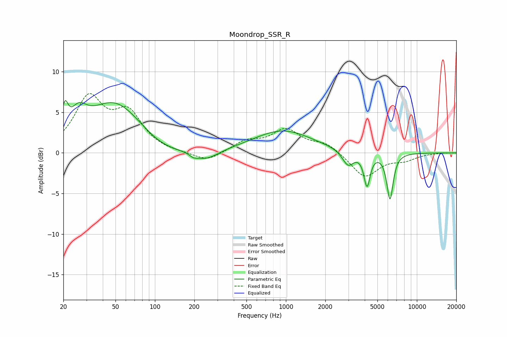

# Moondrop_SSR_R
See [usage instructions](https://github.com/jaakkopasanen/AutoEq#usage) for more options and info.

### Parametric EQs
Apply preamp of -6.6 dB when using parametric equalizer.

|   # | Type    |   Fc (Hz) |    Q |   Gain (dB) |
|-----|---------|-----------|------|-------------|
|   1 | Peaking |        21 | 5.95 |         3   |
|   2 | Peaking |        26 | 2.33 |         2.5 |
|   3 | Peaking |        49 | 0.66 |         6.2 |
|   4 | Peaking |       111 | 0.93 |        -1.1 |
|   5 | Peaking |       197 | 5.85 |        -0.3 |
|   6 | Peaking |       242 | 1.43 |        -1.4 |
|   7 | Peaking |       948 | 0.64 |         2.8 |
|   8 | Peaking |      2983 | 3.26 |        -1.9 |
|   9 | Peaking |      4166 | 6    |        -4   |
|  10 | Peaking |      6235 | 5.6  |        -5.7 |

### Fixed Band EQs
When using fixed band (also called graphic) equalizer, apply preamp of **-7.4 dB** (if available) and set gains manually with these parameters.

|   # | Type    |   Fc (Hz) |    Q |   Gain (dB) |
|-----|---------|-----------|------|-------------|
|   1 | Peaking |        31 | 1.41 |         6.5 |
|   2 | Peaking |        62 | 1.41 |         4.4 |
|   3 | Peaking |       125 | 1.41 |        -0.1 |
|   4 | Peaking |       250 | 1.41 |        -1.2 |
|   5 | Peaking |       500 | 1.41 |         1.3 |
|   6 | Peaking |      1000 | 1.41 |         2.7 |
|   7 | Peaking |      2000 | 1.41 |         1.2 |
|   8 | Peaking |      4000 | 1.41 |        -3   |
|   9 | Peaking |      8000 | 1.41 |        -0.8 |
|  10 | Peaking |     16000 | 1.41 |         0   |

### Graphs

