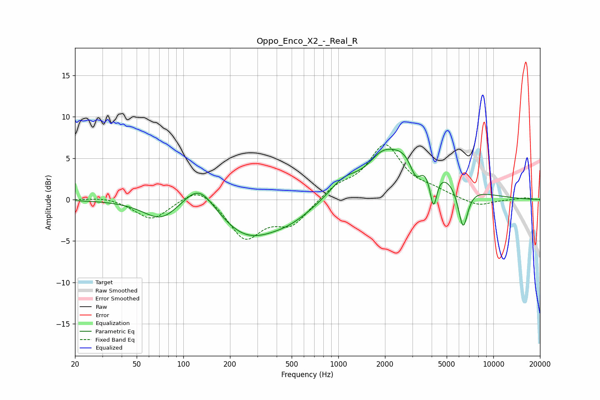

# Oppo_Enco_X2_-_Real_R
See [usage instructions](https://github.com/jaakkopasanen/AutoEq#usage) for more options and info.

### Parametric EQs
Apply preamp of -6.2 dB when using parametric equalizer.

|   # | Type    |   Fc (Hz) |    Q |   Gain (dB) |
|-----|---------|-----------|------|-------------|
|   1 | Peaking |        72 | 1.28 |        -2.3 |
|   2 | Peaking |       127 | 1.38 |         3.5 |
|   3 | Peaking |       255 | 0.72 |        -4.3 |
|   4 | Peaking |       493 | 0.91 |        -1.6 |
|   5 | Peaking |      1070 | 1.66 |         1.6 |
|   6 | Peaking |      1889 | 1.96 |         1.4 |
|   7 | Peaking |      2871 | 0.71 |         6.4 |
|   8 | Peaking |      3163 | 3.45 |        -3.2 |
|   9 | Peaking |      4107 | 6    |        -4.7 |
|  10 | Peaking |      6378 | 4.32 |        -5.2 |

### Fixed Band EQs
When using fixed band (also called graphic) equalizer, apply preamp of **-6.7 dB** (if available) and set gains manually with these parameters.

|   # | Type    |   Fc (Hz) |    Q |   Gain (dB) |
|-----|---------|-----------|------|-------------|
|   1 | Peaking |        31 | 1.41 |         0.4 |
|   2 | Peaking |        62 | 1.41 |        -2.5 |
|   3 | Peaking |       125 | 1.41 |         1.9 |
|   4 | Peaking |       250 | 1.41 |        -4.6 |
|   5 | Peaking |       500 | 1.41 |        -2.9 |
|   6 | Peaking |      1000 | 1.41 |         1.4 |
|   7 | Peaking |      2000 | 1.41 |         6.4 |
|   8 | Peaking |      4000 | 1.41 |         0.8 |
|   9 | Peaking |      8000 | 1.41 |        -0.9 |
|  10 | Peaking |     16000 | 1.41 |         0.2 |

### Graphs

