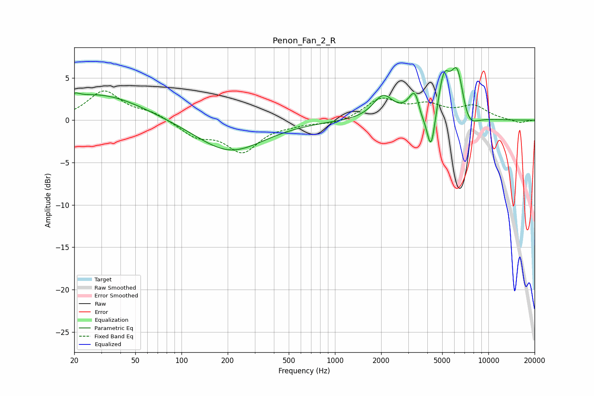

# Penon_Fan_2_R
See [usage instructions](https://github.com/jaakkopasanen/AutoEq#usage) for more options and info.

### Parametric EQs
Apply preamp of -6.3 dB when using parametric equalizer.

|   # | Type    |   Fc (Hz) |    Q |   Gain (dB) |
|-----|---------|-----------|------|-------------|
|   1 | Peaking |        20 | 4.68 |         0.5 |
|   2 | Peaking |        29 | 0.5  |         3.1 |
|   3 | Peaking |       207 | 0.65 |        -3.7 |
|   4 | Peaking |      2061 | 2.16 |         2.7 |
|   5 | Peaking |      3382 | 3.42 |         4.2 |
|   6 | Peaking |      3589 | 4.76 |        -2   |
|   7 | Peaking |      4226 | 4.91 |        -5.3 |
|   8 | Peaking |      5118 | 3.71 |         4.6 |
|   9 | Peaking |      6278 | 3.07 |         6.3 |
|  10 | Peaking |      7315 | 2.44 |        -2.4 |

### Fixed Band EQs
When using fixed band (also called graphic) equalizer, apply preamp of **-3.6 dB** (if available) and set gains manually with these parameters.

|   # | Type    |   Fc (Hz) |    Q |   Gain (dB) |
|-----|---------|-----------|------|-------------|
|   1 | Peaking |        31 | 1.41 |         3.4 |
|   2 | Peaking |        62 | 1.41 |         0.9 |
|   3 | Peaking |       125 | 1.41 |        -1.7 |
|   4 | Peaking |       250 | 1.41 |        -3.5 |
|   5 | Peaking |       500 | 1.41 |        -0.3 |
|   6 | Peaking |      1000 | 1.41 |        -0.5 |
|   7 | Peaking |      2000 | 1.41 |         2.4 |
|   8 | Peaking |      4000 | 1.41 |         1.5 |
|   9 | Peaking |      8000 | 1.41 |         1.5 |
|  10 | Peaking |     16000 | 1.41 |        -0.4 |

### Graphs

