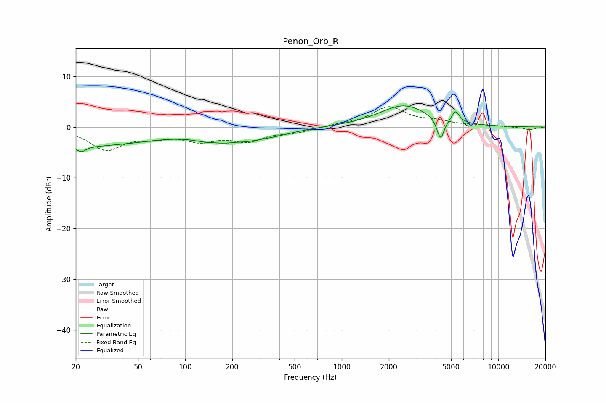

# Penon_Orb_R
See [usage instructions](https://github.com/jaakkopasanen/AutoEq#usage) for more options and info.

### Parametric EQs
Apply preamp of -4.3 dB when using parametric equalizer.

|   # | Type    |   Fc (Hz) |    Q |   Gain (dB) |
|-----|---------|-----------|------|-------------|
|   1 | Peaking |        20 | 0.27 |        -3.8 |
|   2 | Peaking |        22 | 5.72 |        -3.3 |
|   3 | Peaking |        22 | 6    |         2.2 |
|   4 | Peaking |       131 | 1.68 |        -0.8 |
|   5 | Peaking |       205 | 1.33 |        -3.1 |
|   6 | Peaking |       208 | 2.14 |         1.3 |
|   7 | Peaking |       349 | 0.93 |        -1.2 |
|   8 | Peaking |      2494 | 0.9  |         4.3 |
|   9 | Peaking |      4277 | 5.99 |        -4.3 |
|  10 | Peaking |      5329 | 5.76 |         2.3 |

### Fixed Band EQs
When using fixed band (also called graphic) equalizer, apply preamp of **-4.1 dB** (if available) and set gains manually with these parameters.

|   # | Type    |   Fc (Hz) |    Q |   Gain (dB) |
|-----|---------|-----------|------|-------------|
|   1 | Peaking |        31 | 1.41 |        -4.3 |
|   2 | Peaking |        62 | 1.41 |        -1.5 |
|   3 | Peaking |       125 | 1.41 |        -2.3 |
|   4 | Peaking |       250 | 1.41 |        -2.4 |
|   5 | Peaking |       500 | 1.41 |        -0.9 |
|   6 | Peaking |      1000 | 1.41 |         0.4 |
|   7 | Peaking |      2000 | 1.41 |         3.8 |
|   8 | Peaking |      4000 | 1.41 |         0.9 |
|   9 | Peaking |      8000 | 1.41 |         0.3 |
|  10 | Peaking |     16000 | 1.41 |        -0.6 |

### Graphs

