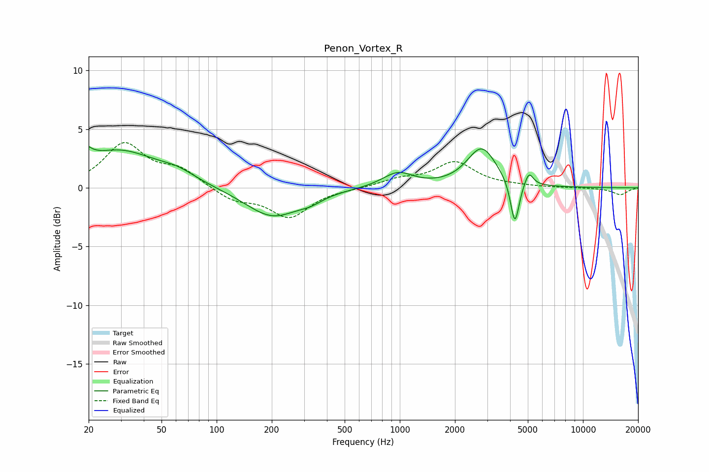

# Penon_Vortex_R
See [usage instructions](https://github.com/jaakkopasanen/AutoEq#usage) for more options and info.

### Parametric EQs
Apply preamp of -3.6 dB when using parametric equalizer.

|   # | Type    |   Fc (Hz) |    Q |   Gain (dB) |
|-----|---------|-----------|------|-------------|
|   1 | Peaking |        20 | 5.37 |         3.2 |
|   2 | Peaking |        20 | 6    |        -2.2 |
|   3 | Peaking |        29 | 0.68 |         3.1 |
|   4 | Peaking |        61 | 1.43 |         0.7 |
|   5 | Peaking |       202 | 0.96 |        -2.5 |
|   6 | Peaking |       326 | 2.29 |        -0.4 |
|   7 | Peaking |       975 | 1.69 |         1.3 |
|   8 | Peaking |      2802 | 1.76 |         3.4 |
|   9 | Peaking |      4247 | 5.99 |        -3.9 |
|  10 | Peaking |      5068 | 6    |         1.2 |

### Fixed Band EQs
When using fixed band (also called graphic) equalizer, apply preamp of **-4.0 dB** (if available) and set gains manually with these parameters.

|   # | Type    |   Fc (Hz) |    Q |   Gain (dB) |
|-----|---------|-----------|------|-------------|
|   1 | Peaking |        31 | 1.41 |         3.7 |
|   2 | Peaking |        62 | 1.41 |         1.4 |
|   3 | Peaking |       125 | 1.41 |        -1   |
|   4 | Peaking |       250 | 1.41 |        -2.5 |
|   5 | Peaking |       500 | 1.41 |        -0.1 |
|   6 | Peaking |      1000 | 1.41 |         0.6 |
|   7 | Peaking |      2000 | 1.41 |         2.1 |
|   8 | Peaking |      4000 | 1.41 |         0.1 |
|   9 | Peaking |      8000 | 1.41 |         0   |
|  10 | Peaking |     16000 | 1.41 |        -0.6 |

### Graphs

