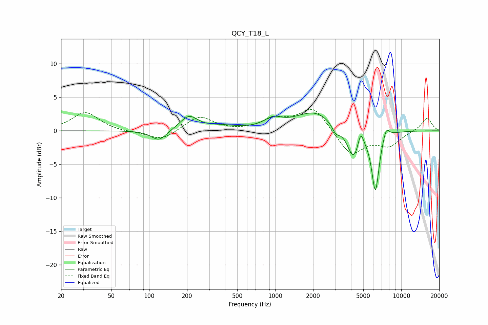

# QCY_T18_L
See [usage instructions](https://github.com/jaakkopasanen/AutoEq#usage) for more options and info.

### Parametric EQs
Apply preamp of -2.7 dB when using parametric equalizer.

|   # | Type    |   Fc (Hz) |    Q |   Gain (dB) |
|-----|---------|-----------|------|-------------|
|   1 | Peaking |       120 | 2.36 |        -1.6 |
|   2 | Peaking |       207 | 2.02 |         2.1 |
|   3 | Peaking |       375 | 1.22 |         0.5 |
|   4 | Peaking |       960 | 2.06 |         1.3 |
|   5 | Peaking |      2061 | 0.91 |         2.8 |
|   6 | Peaking |      3023 | 4.7  |        -1.3 |
|   7 | Peaking |      4190 | 2.77 |        -4.5 |
|   8 | Peaking |      4765 | 6    |         2.5 |
|   9 | Peaking |      6236 | 4.55 |        -8.9 |
|  10 | Peaking |      7601 | 5.39 |         1.7 |

### Fixed Band EQs
When using fixed band (also called graphic) equalizer, apply preamp of **-3.3 dB** (if available) and set gains manually with these parameters.

|   # | Type    |   Fc (Hz) |    Q |   Gain (dB) |
|-----|---------|-----------|------|-------------|
|   1 | Peaking |        31 | 1.41 |         2.8 |
|   2 | Peaking |        62 | 1.41 |        -0.2 |
|   3 | Peaking |       125 | 1.41 |        -1.5 |
|   4 | Peaking |       250 | 1.41 |         2.2 |
|   5 | Peaking |       500 | 1.41 |        -0.1 |
|   6 | Peaking |      1000 | 1.41 |         1.6 |
|   7 | Peaking |      2000 | 1.41 |         3.5 |
|   8 | Peaking |      4000 | 1.41 |        -3.7 |
|   9 | Peaking |      8000 | 1.41 |        -2.1 |
|  10 | Peaking |     16000 | 1.41 |         2   |

### Graphs

