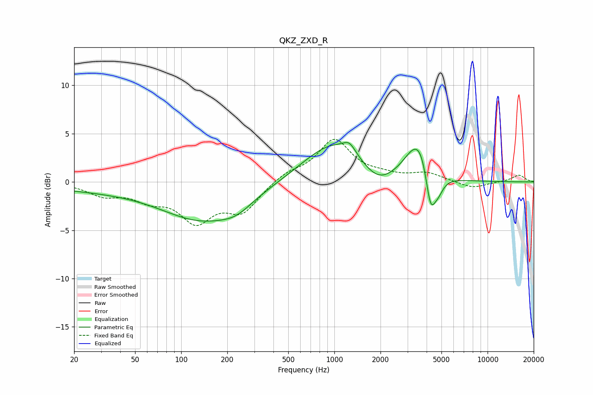

# QKZ_ZXD_R
See [usage instructions](https://github.com/jaakkopasanen/AutoEq#usage) for more options and info.

### Parametric EQs
Apply preamp of -4.2 dB when using parametric equalizer.

|   # | Type    |   Fc (Hz) |    Q |   Gain (dB) |
|-----|---------|-----------|------|-------------|
|   1 | Peaking |        27 | 0.37 |        -0.7 |
|   2 | Peaking |       138 | 0.53 |        -3.7 |
|   3 | Peaking |       229 | 1.37 |        -1   |
|   4 | Peaking |       982 | 0.73 |         4.1 |
|   5 | Peaking |      1254 | 3.52 |         1.1 |
|   6 | Peaking |      1930 | 1.41 |        -1.7 |
|   7 | Peaking |      3350 | 1.81 |         2.9 |
|   8 | Peaking |      3689 | 3.01 |         1.5 |
|   9 | Peaking |      4242 | 4.55 |        -3.9 |
|  10 | Peaking |      4751 | 3.89 |        -1.5 |

### Fixed Band EQs
When using fixed band (also called graphic) equalizer, apply preamp of **-4.5 dB** (if available) and set gains manually with these parameters.

|   # | Type    |   Fc (Hz) |    Q |   Gain (dB) |
|-----|---------|-----------|------|-------------|
|   1 | Peaking |        31 | 1.41 |        -1.2 |
|   2 | Peaking |        62 | 1.41 |        -1.5 |
|   3 | Peaking |       125 | 1.41 |        -3.7 |
|   4 | Peaking |       250 | 1.41 |        -2.9 |
|   5 | Peaking |       500 | 1.41 |         0.9 |
|   6 | Peaking |      1000 | 1.41 |         4.3 |
|   7 | Peaking |      2000 | 1.41 |         0.5 |
|   8 | Peaking |      4000 | 1.41 |         0.9 |
|   9 | Peaking |      8000 | 1.41 |        -0.7 |
|  10 | Peaking |     16000 | 1.41 |         0.7 |

### Graphs

