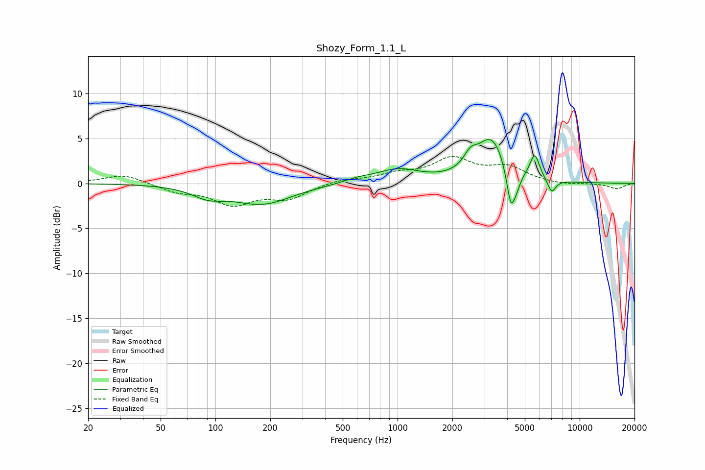

# Shozy_Form_1.1_L
See [usage instructions](https://github.com/jaakkopasanen/AutoEq#usage) for more options and info.

### Parametric EQs
Apply preamp of -5.0 dB when using parametric equalizer.

|   # | Type    |   Fc (Hz) |    Q |   Gain (dB) |
|-----|---------|-----------|------|-------------|
|   1 | Peaking |        91 | 1.64 |        -1.1 |
|   2 | Peaking |       181 | 0.87 |        -2.2 |
|   3 | Peaking |       601 | 1.9  |         0.4 |
|   4 | Peaking |      1003 | 1.18 |         1.5 |
|   5 | Peaking |      2508 | 3.98 |         1.4 |
|   6 | Peaking |      3277 | 1.74 |         4.9 |
|   7 | Peaking |      4190 | 5.81 |        -4.5 |
|   8 | Peaking |      4526 | 5.99 |        -1.1 |
|   9 | Peaking |      5666 | 5.34 |         2.7 |
|  10 | Peaking |      7022 | 5.98 |        -1.5 |

### Fixed Band EQs
When using fixed band (also called graphic) equalizer, apply preamp of **-3.1 dB** (if available) and set gains manually with these parameters.

|   # | Type    |   Fc (Hz) |    Q |   Gain (dB) |
|-----|---------|-----------|------|-------------|
|   1 | Peaking |        31 | 1.41 |         1   |
|   2 | Peaking |        62 | 1.41 |        -0.8 |
|   3 | Peaking |       125 | 1.41 |        -2.2 |
|   4 | Peaking |       250 | 1.41 |        -1.6 |
|   5 | Peaking |       500 | 1.41 |         0.5 |
|   6 | Peaking |      1000 | 1.41 |         0.9 |
|   7 | Peaking |      2000 | 1.41 |         2.6 |
|   8 | Peaking |      4000 | 1.41 |         1.6 |
|   9 | Peaking |      8000 | 1.41 |        -0.2 |
|  10 | Peaking |     16000 | 1.41 |        -0.6 |

### Graphs

