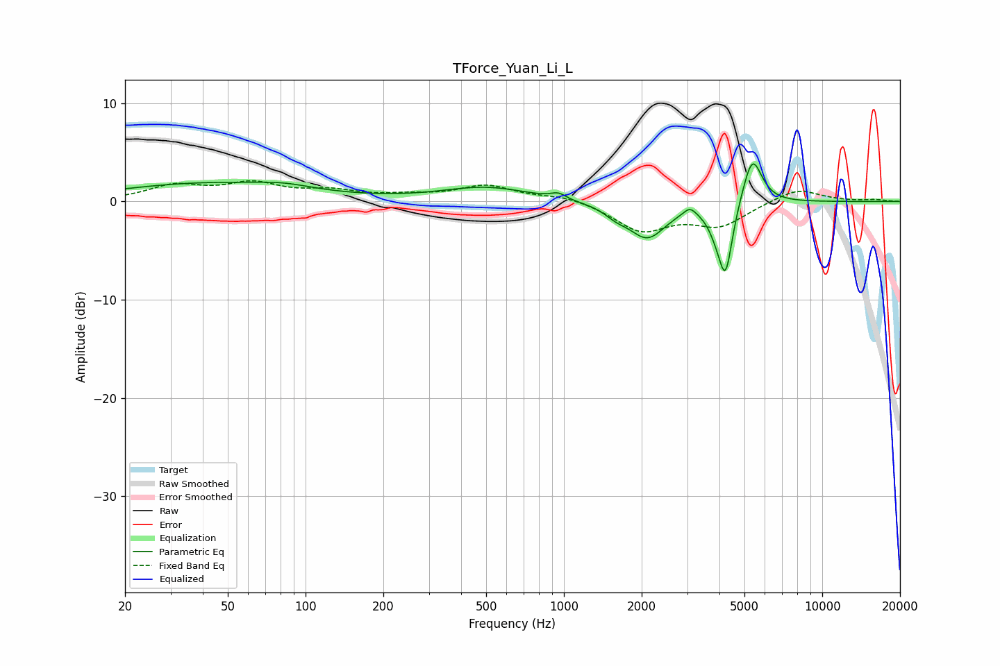

# TForce_Yuan_Li_L
See [usage instructions](https://github.com/jaakkopasanen/AutoEq#usage) for more options and info.

### Parametric EQs
Apply preamp of -3.9 dB when using parametric equalizer.

|   # | Type    |   Fc (Hz) |    Q |   Gain (dB) |
|-----|---------|-----------|------|-------------|
|   1 | Peaking |        42 | 0.4  |         1.8 |
|   2 | Peaking |        83 | 1.36 |         0.5 |
|   3 | Peaking |       500 | 0.84 |         1.4 |
|   4 | Peaking |       951 | 4.95 |         0.6 |
|   5 | Peaking |      1589 | 3.17 |        -0.7 |
|   6 | Peaking |      2102 | 1.96 |        -3.6 |
|   7 | Peaking |      3071 | 5.94 |         0.8 |
|   8 | Peaking |      3899 | 4.03 |        -1.6 |
|   9 | Peaking |      4226 | 5.26 |        -6.7 |
|  10 | Peaking |      5361 | 3.74 |         5   |

### Fixed Band EQs
When using fixed band (also called graphic) equalizer, apply preamp of **-2.2 dB** (if available) and set gains manually with these parameters.

|   # | Type    |   Fc (Hz) |    Q |   Gain (dB) |
|-----|---------|-----------|------|-------------|
|   1 | Peaking |        31 | 1.41 |         1.5 |
|   2 | Peaking |        62 | 1.41 |         1.6 |
|   3 | Peaking |       125 | 1.41 |         0.9 |
|   4 | Peaking |       250 | 1.41 |         0.5 |
|   5 | Peaking |       500 | 1.41 |         1.5 |
|   6 | Peaking |      1000 | 1.41 |         0.6 |
|   7 | Peaking |      2000 | 1.41 |        -2.9 |
|   8 | Peaking |      4000 | 1.41 |        -2.3 |
|   9 | Peaking |      8000 | 1.41 |         1.4 |
|  10 | Peaking |     16000 | 1.41 |         0.2 |

### Graphs

