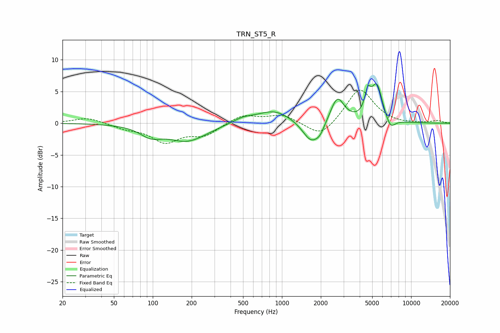

# TRN_ST5_R
See [usage instructions](https://github.com/jaakkopasanen/AutoEq#usage) for more options and info.

### Parametric EQs
Apply preamp of -6.3 dB when using parametric equalizer.

|   # | Type    |   Fc (Hz) |    Q |   Gain (dB) |
|-----|---------|-----------|------|-------------|
|   1 | Peaking |        96 | 1.76 |        -1.5 |
|   2 | Peaking |       185 | 0.93 |        -2.8 |
|   3 | Peaking |       501 | 1.67 |         0.8 |
|   4 | Peaking |       874 | 1.1  |         2   |
|   5 | Peaking |      1687 | 2.11 |        -3.4 |
|   6 | Peaking |      1976 | 4.08 |        -1.1 |
|   7 | Peaking |      2683 | 2.67 |         4.1 |
|   8 | Peaking |      4616 | 6    |         3.1 |
|   9 | Peaking |      5427 | 3.19 |         5.8 |
|  10 | Peaking |      6914 | 3.76 |        -1.8 |

### Fixed Band EQs
When using fixed band (also called graphic) equalizer, apply preamp of **-5.3 dB** (if available) and set gains manually with these parameters.

|   # | Type    |   Fc (Hz) |    Q |   Gain (dB) |
|-----|---------|-----------|------|-------------|
|   1 | Peaking |        31 | 1.41 |         0.9 |
|   2 | Peaking |        62 | 1.41 |        -0.7 |
|   3 | Peaking |       125 | 1.41 |        -2.8 |
|   4 | Peaking |       250 | 1.41 |        -1.8 |
|   5 | Peaking |       500 | 1.41 |         1.4 |
|   6 | Peaking |      1000 | 1.41 |         1.3 |
|   7 | Peaking |      2000 | 1.41 |        -2.4 |
|   8 | Peaking |      4000 | 1.41 |         5.6 |
|   9 | Peaking |      8000 | 1.41 |        -0.2 |
|  10 | Peaking |     16000 | 1.41 |         0.4 |

### Graphs

