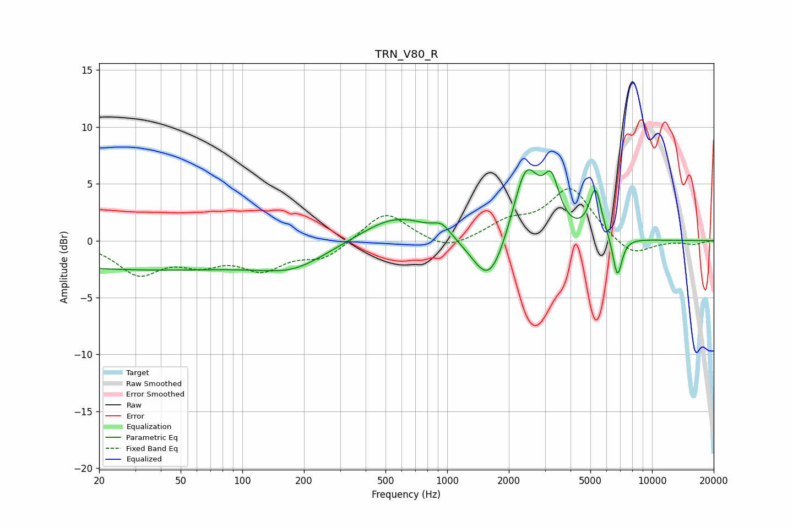

# TRN_V80_R
See [usage instructions](https://github.com/jaakkopasanen/AutoEq#usage) for more options and info.

### Parametric EQs
Apply preamp of -6.3 dB when using parametric equalizer.

|   # | Type    |   Fc (Hz) |    Q |   Gain (dB) |
|-----|---------|-----------|------|-------------|
|   1 | Peaking |        33 | 0.18 |        -2.5 |
|   2 | Peaking |       179 | 0.89 |        -1.5 |
|   3 | Peaking |       566 | 0.83 |         2.3 |
|   4 | Peaking |       942 | 3.4  |         0.9 |
|   5 | Peaking |      1549 | 1.77 |        -0.5 |
|   6 | Peaking |      1612 | 1.75 |        -4.2 |
|   7 | Peaking |      2427 | 2.15 |         6.7 |
|   8 | Peaking |      3227 | 3.75 |         3.8 |
|   9 | Peaking |      5291 | 4.61 |         4.2 |
|  10 | Peaking |      6775 | 6    |        -3.6 |

### Fixed Band EQs
When using fixed band (also called graphic) equalizer, apply preamp of **-4.7 dB** (if available) and set gains manually with these parameters.

|   # | Type    |   Fc (Hz) |    Q |   Gain (dB) |
|-----|---------|-----------|------|-------------|
|   1 | Peaking |        31 | 1.41 |        -2.7 |
|   2 | Peaking |        62 | 1.41 |        -1.6 |
|   3 | Peaking |       125 | 1.41 |        -2.2 |
|   4 | Peaking |       250 | 1.41 |        -1.5 |
|   5 | Peaking |       500 | 1.41 |         2.7 |
|   6 | Peaking |      1000 | 1.41 |        -1   |
|   7 | Peaking |      2000 | 1.41 |         1.4 |
|   8 | Peaking |      4000 | 1.41 |         4.5 |
|   9 | Peaking |      8000 | 1.41 |        -1.5 |
|  10 | Peaking |     16000 | 1.41 |        -0.3 |

### Graphs

