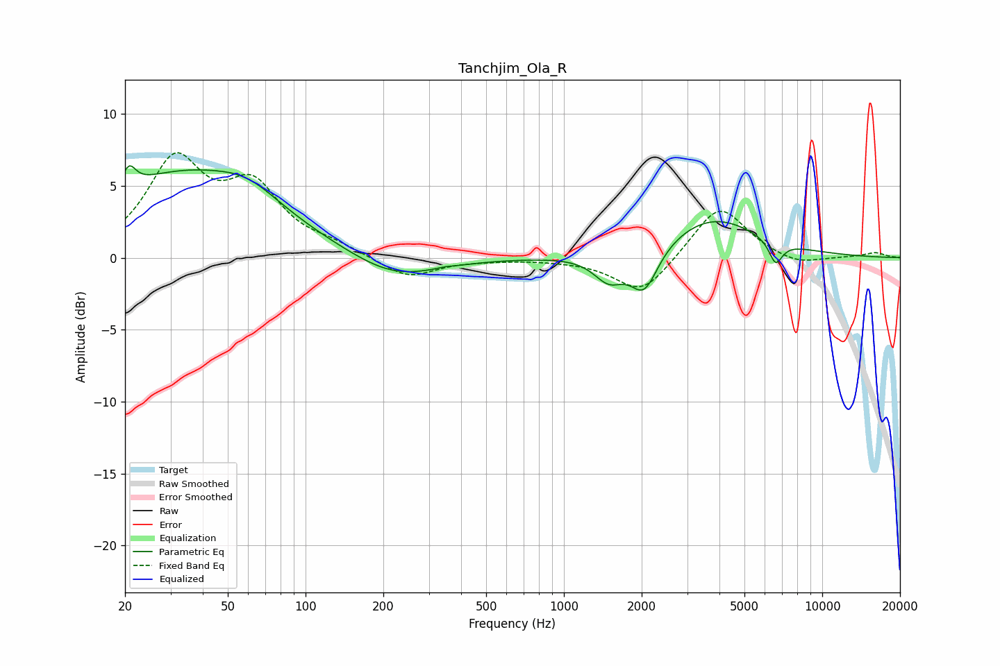

# Tanchjim_Ola_R
See [usage instructions](https://github.com/jaakkopasanen/AutoEq#usage) for more options and info.

### Parametric EQs
Apply preamp of -6.5 dB when using parametric equalizer.

|   # | Type    |   Fc (Hz) |    Q |   Gain (dB) |
|-----|---------|-----------|------|-------------|
|   1 | Peaking |        21 | 5.56 |         1.4 |
|   2 | Peaking |        33 | 0.42 |         5.7 |
|   3 | Peaking |        60 | 1.21 |         1.2 |
|   4 | Peaking |       220 | 0.83 |        -1.7 |
|   5 | Peaking |       346 | 5.97 |         0.1 |
|   6 | Peaking |      1494 | 2.38 |        -1.8 |
|   7 | Peaking |      2047 | 2.63 |        -3   |
|   8 | Peaking |      3757 | 0.77 |         2.8 |
|   9 | Peaking |      6661 | 5.42 |        -3.3 |
|  10 | Peaking |      6708 | 5.84 |         1.7 |

### Fixed Band EQs
When using fixed band (also called graphic) equalizer, apply preamp of **-7.4 dB** (if available) and set gains manually with these parameters.

|   # | Type    |   Fc (Hz) |    Q |   Gain (dB) |
|-----|---------|-----------|------|-------------|
|   1 | Peaking |        31 | 1.41 |         6.4 |
|   2 | Peaking |        62 | 1.41 |         4.4 |
|   3 | Peaking |       125 | 1.41 |         0.6 |
|   4 | Peaking |       250 | 1.41 |        -1.5 |
|   5 | Peaking |       500 | 1.41 |        -0.1 |
|   6 | Peaking |      1000 | 1.41 |        -0.1 |
|   7 | Peaking |      2000 | 1.41 |        -2.6 |
|   8 | Peaking |      4000 | 1.41 |         3.8 |
|   9 | Peaking |      8000 | 1.41 |        -0.6 |
|  10 | Peaking |     16000 | 1.41 |         0.4 |

### Graphs

