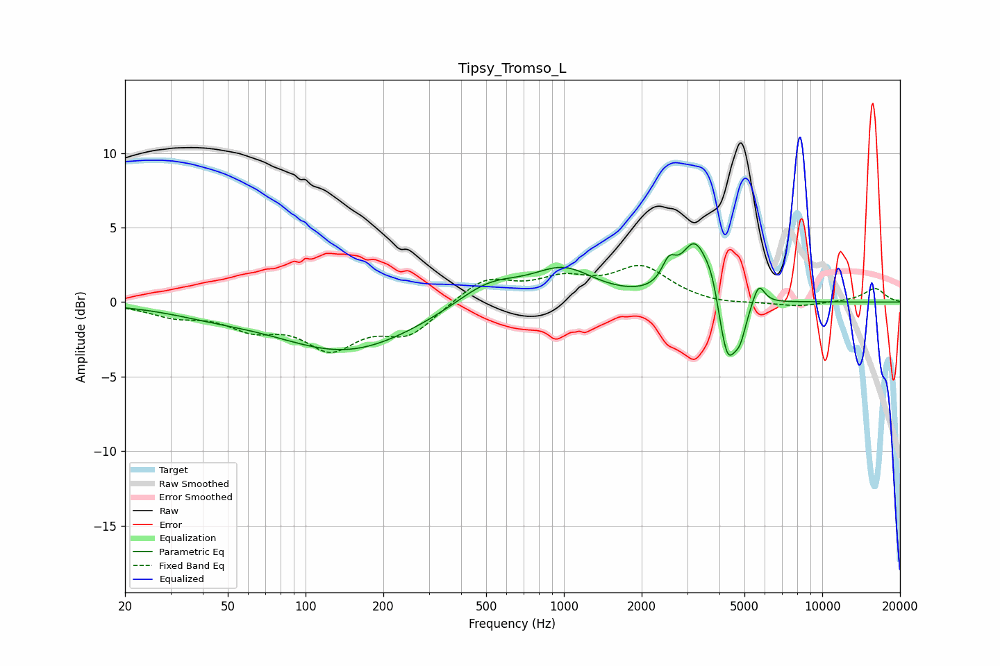

# Tipsy_Tromso_L
See [usage instructions](https://github.com/jaakkopasanen/AutoEq#usage) for more options and info.

### Parametric EQs
Apply preamp of -4.0 dB when using parametric equalizer.

|   # | Type    |   Fc (Hz) |    Q |   Gain (dB) |
|-----|---------|-----------|------|-------------|
|   1 | Peaking |        43 | 0.81 |        -0.5 |
|   2 | Peaking |       145 | 0.52 |        -3.3 |
|   3 | Peaking |       511 | 1.1  |         1.6 |
|   4 | Peaking |       997 | 1.18 |         2.1 |
|   5 | Peaking |      2549 | 5.15 |         1.5 |
|   6 | Peaking |      3214 | 2.67 |         3.8 |
|   7 | Peaking |      3751 | 4.58 |         1.4 |
|   8 | Peaking |      4288 | 3.94 |        -4.7 |
|   9 | Peaking |      4817 | 6    |        -1.6 |
|  10 | Peaking |      5675 | 5.98 |         1.5 |

### Fixed Band EQs
When using fixed band (also called graphic) equalizer, apply preamp of **-2.6 dB** (if available) and set gains manually with these parameters.

|   # | Type    |   Fc (Hz) |    Q |   Gain (dB) |
|-----|---------|-----------|------|-------------|
|   1 | Peaking |        31 | 1.41 |        -0.8 |
|   2 | Peaking |        62 | 1.41 |        -1.5 |
|   3 | Peaking |       125 | 1.41 |        -2.8 |
|   4 | Peaking |       250 | 1.41 |        -2   |
|   5 | Peaking |       500 | 1.41 |         1.6 |
|   6 | Peaking |      1000 | 1.41 |         1.3 |
|   7 | Peaking |      2000 | 1.41 |         2.2 |
|   8 | Peaking |      4000 | 1.41 |        -0.2 |
|   9 | Peaking |      8000 | 1.41 |        -0.3 |
|  10 | Peaking |     16000 | 1.41 |         0.9 |

### Graphs

