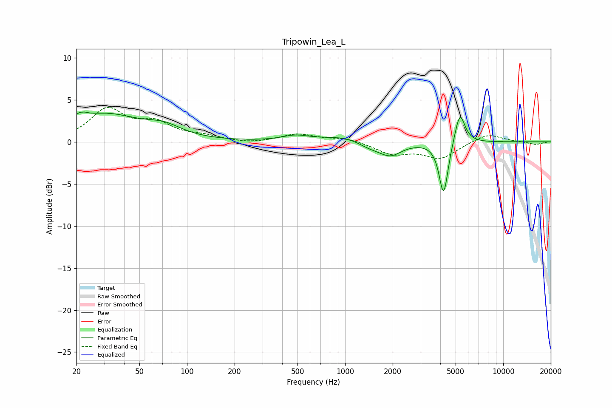

# Tripowin_Lea_L
See [usage instructions](https://github.com/jaakkopasanen/AutoEq#usage) for more options and info.

### Parametric EQs
Apply preamp of -3.6 dB when using parametric equalizer.

|   # | Type    |   Fc (Hz) |    Q |   Gain (dB) |
|-----|---------|-----------|------|-------------|
|   1 | Peaking |        21 | 5.31 |         3.4 |
|   2 | Peaking |        21 | 6    |        -2.6 |
|   3 | Peaking |        30 | 0.63 |         3.2 |
|   4 | Peaking |        72 | 1.3  |         1.1 |
|   5 | Peaking |       484 | 1.71 |         0.6 |
|   6 | Peaking |      1064 | 0.94 |         0.8 |
|   7 | Peaking |      1405 | 1.72 |        -0.8 |
|   8 | Peaking |      1929 | 1.93 |        -1.6 |
|   9 | Peaking |      4200 | 4.91 |        -6.4 |
|  10 | Peaking |      5317 | 4.33 |         3.8 |

### Fixed Band EQs
When using fixed band (also called graphic) equalizer, apply preamp of **-4.2 dB** (if available) and set gains manually with these parameters.

|   # | Type    |   Fc (Hz) |    Q |   Gain (dB) |
|-----|---------|-----------|------|-------------|
|   1 | Peaking |        31 | 1.41 |         3.7 |
|   2 | Peaking |        62 | 1.41 |         2   |
|   3 | Peaking |       125 | 1.41 |         0.5 |
|   4 | Peaking |       250 | 1.41 |        -0.3 |
|   5 | Peaking |       500 | 1.41 |         0.9 |
|   6 | Peaking |      1000 | 1.41 |         0.4 |
|   7 | Peaking |      2000 | 1.41 |        -1.4 |
|   8 | Peaking |      4000 | 1.41 |        -1.9 |
|   9 | Peaking |      8000 | 1.41 |         1   |
|  10 | Peaking |     16000 | 1.41 |        -0.3 |

### Graphs

