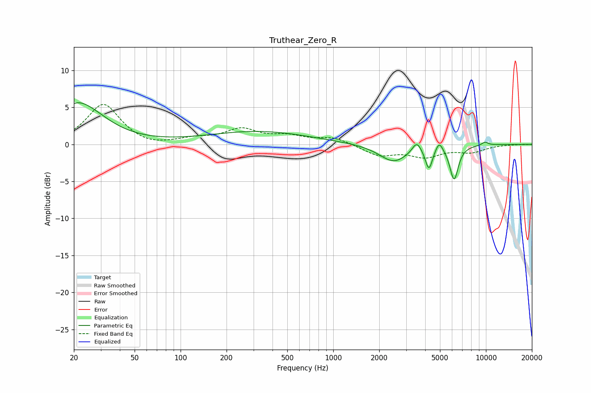

# Truthear_Zero_R
See [usage instructions](https://github.com/jaakkopasanen/AutoEq#usage) for more options and info.

### Parametric EQs
Apply preamp of -5.7 dB when using parametric equalizer.

|   # | Type    |   Fc (Hz) |    Q |   Gain (dB) |
|-----|---------|-----------|------|-------------|
|   1 | Peaking |        20 | 1.44 |         2.2 |
|   2 | Peaking |        24 | 0.87 |         3.6 |
|   3 | Peaking |       323 | 0.43 |         1.7 |
|   4 | Peaking |      2488 | 1.49 |        -2.4 |
|   5 | Peaking |      3523 | 4.86 |         1.5 |
|   6 | Peaking |      4233 | 5.96 |        -3   |
|   7 | Peaking |      4578 | 2.36 |         0.1 |
|   8 | Peaking |      4945 | 5.99 |         1.3 |
|   9 | Peaking |      6186 | 4.97 |        -4.6 |
|  10 | Peaking |      9858 | 5.79 |         0.5 |

### Fixed Band EQs
When using fixed band (also called graphic) equalizer, apply preamp of **-5.5 dB** (if available) and set gains manually with these parameters.

|   # | Type    |   Fc (Hz) |    Q |   Gain (dB) |
|-----|---------|-----------|------|-------------|
|   1 | Peaking |        31 | 1.41 |         5.4 |
|   2 | Peaking |        62 | 1.41 |        -0.5 |
|   3 | Peaking |       125 | 1.41 |         0.6 |
|   4 | Peaking |       250 | 1.41 |         1.9 |
|   5 | Peaking |       500 | 1.41 |         1   |
|   6 | Peaking |      1000 | 1.41 |         0.9 |
|   7 | Peaking |      2000 | 1.41 |        -1.5 |
|   8 | Peaking |      4000 | 1.41 |        -1.5 |
|   9 | Peaking |      8000 | 1.41 |        -0.9 |
|  10 | Peaking |     16000 | 1.41 |         0   |

### Graphs

