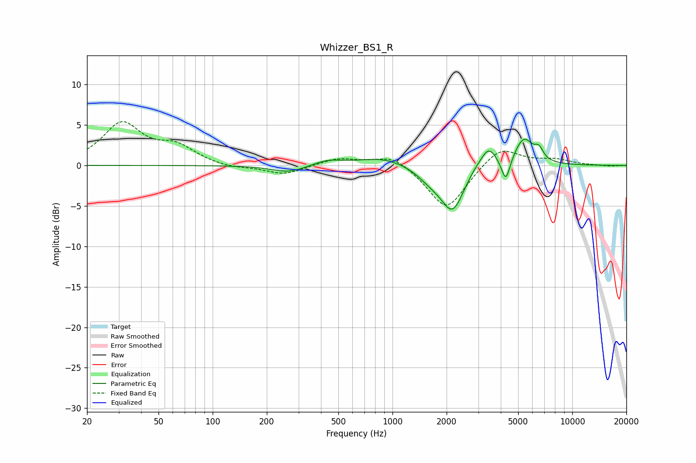

# Whizzer_BS1_R
See [usage instructions](https://github.com/jaakkopasanen/AutoEq#usage) for more options and info.

### Parametric EQs
Apply preamp of -3.3 dB when using parametric equalizer.

|   # | Type    |   Fc (Hz) |    Q |   Gain (dB) |
|-----|---------|-----------|------|-------------|
|   1 | Peaking |       265 | 1.5  |        -0.9 |
|   2 | Peaking |       435 | 1.73 |         0.7 |
|   3 | Peaking |       882 | 1.05 |         1   |
|   4 | Peaking |      1621 | 1.97 |        -1.2 |
|   5 | Peaking |      2161 | 2.15 |        -5.5 |
|   6 | Peaking |      2888 | 2.44 |         0.7 |
|   7 | Peaking |      3428 | 3.29 |         2.4 |
|   8 | Peaking |      4270 | 6    |        -3   |
|   9 | Peaking |      5379 | 2.65 |         3.3 |
|  10 | Peaking |      6533 | 6    |         1.2 |

### Fixed Band EQs
When using fixed band (also called graphic) equalizer, apply preamp of **-5.5 dB** (if available) and set gains manually with these parameters.

|   # | Type    |   Fc (Hz) |    Q |   Gain (dB) |
|-----|---------|-----------|------|-------------|
|   1 | Peaking |        31 | 1.41 |         5   |
|   2 | Peaking |        62 | 1.41 |         2.1 |
|   3 | Peaking |       125 | 1.41 |        -0.4 |
|   4 | Peaking |       250 | 1.41 |        -1.2 |
|   5 | Peaking |       500 | 1.41 |         0.9 |
|   6 | Peaking |      1000 | 1.41 |         1.5 |
|   7 | Peaking |      2000 | 1.41 |        -5.6 |
|   8 | Peaking |      4000 | 1.41 |         2.5 |
|   9 | Peaking |      8000 | 1.41 |         0.7 |
|  10 | Peaking |     16000 | 1.41 |        -0.1 |

### Graphs

