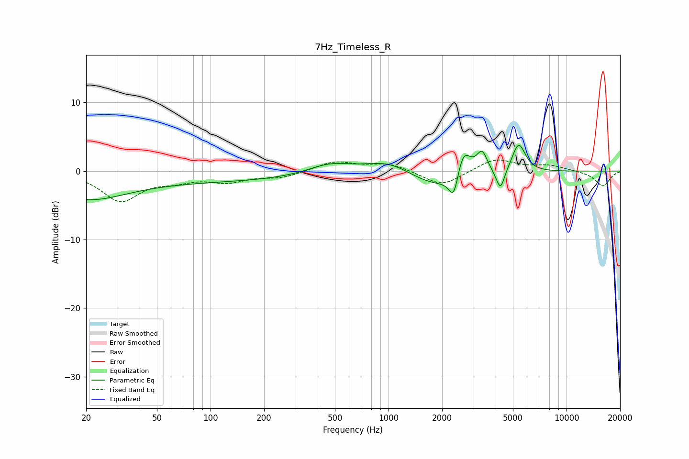

# 7Hz_Timeless_R
See [usage instructions](https://github.com/jaakkopasanen/AutoEq#usage) for more options and info.

### Parametric EQs
Apply preamp of -3.9 dB when using parametric equalizer.

|   # | Type    |   Fc (Hz) |    Q |   Gain (dB) |
|-----|---------|-----------|------|-------------|
|   1 | Peaking |        20 | 0.67 |        -3.1 |
|   2 | Peaking |        79 | 0.18 |        -1.5 |
|   3 | Peaking |       465 | 1.16 |         1.5 |
|   4 | Peaking |      1025 | 1    |         2.2 |
|   5 | Peaking |      1886 | 0.74 |        -2.9 |
|   6 | Peaking |      2330 | 5.14 |        -4   |
|   7 | Peaking |      2622 | 3.25 |         4.8 |
|   8 | Peaking |      3355 | 4.58 |         3.2 |
|   9 | Peaking |      4254 | 6    |        -3.1 |
|  10 | Peaking |      5385 | 3.69 |         4.3 |

### Fixed Band EQs
When using fixed band (also called graphic) equalizer, apply preamp of **-1.7 dB** (if available) and set gains manually with these parameters.

|   # | Type    |   Fc (Hz) |    Q |   Gain (dB) |
|-----|---------|-----------|------|-------------|
|   1 | Peaking |        31 | 1.41 |        -4.2 |
|   2 | Peaking |        62 | 1.41 |        -1.1 |
|   3 | Peaking |       125 | 1.41 |        -1.4 |
|   4 | Peaking |       250 | 1.41 |        -0.9 |
|   5 | Peaking |       500 | 1.41 |         1.4 |
|   6 | Peaking |      1000 | 1.41 |         1.1 |
|   7 | Peaking |      2000 | 1.41 |        -2.3 |
|   8 | Peaking |      4000 | 1.41 |         1.8 |
|   9 | Peaking |      8000 | 1.41 |         0.8 |
|  10 | Peaking |     16000 | 1.41 |        -2.2 |

### Graphs

