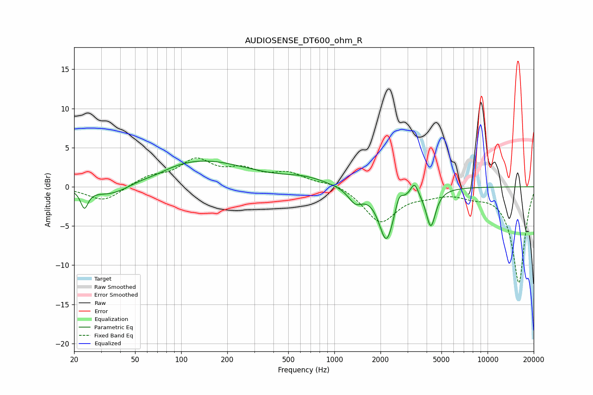

# AUDIOSENSE_DT600_ohm_R
See [usage instructions](https://github.com/jaakkopasanen/AutoEq#usage) for more options and info.

### Parametric EQs
Apply preamp of -3.4 dB when using parametric equalizer.

|   # | Type    |   Fc (Hz) |    Q |   Gain (dB) |
|-----|---------|-----------|------|-------------|
|   1 | Peaking |        23 | 5.97 |        -2.3 |
|   2 | Peaking |        36 | 1.06 |        -1.7 |
|   3 | Peaking |        69 | 1.54 |        -0.4 |
|   4 | Peaking |       130 | 0.44 |         3.4 |
|   5 | Peaking |       643 | 1.02 |         0.9 |
|   6 | Peaking |      1372 | 3.01 |        -1.8 |
|   7 | Peaking |      2187 | 2.9  |        -6.7 |
|   8 | Peaking |      2642 | 6    |         1.5 |
|   9 | Peaking |      3329 | 5.87 |         1.7 |
|  10 | Peaking |      4262 | 4.57 |        -4.8 |

### Fixed Band EQs
When using fixed band (also called graphic) equalizer, apply preamp of **-3.8 dB** (if available) and set gains manually with these parameters.

|   # | Type    |   Fc (Hz) |    Q |   Gain (dB) |
|-----|---------|-----------|------|-------------|
|   1 | Peaking |        31 | 1.41 |        -1.9 |
|   2 | Peaking |        62 | 1.41 |         1.2 |
|   3 | Peaking |       125 | 1.41 |         3.2 |
|   4 | Peaking |       250 | 1.41 |         1.8 |
|   5 | Peaking |       500 | 1.41 |         1.5 |
|   6 | Peaking |      1000 | 1.41 |         0.6 |
|   7 | Peaking |      2000 | 1.41 |        -4.5 |
|   8 | Peaking |      4000 | 1.41 |        -0.7 |
|   9 | Peaking |      8000 | 1.41 |        -0.8 |
|  10 | Peaking |     16000 | 1.41 |       -12.3 |

### Graphs

