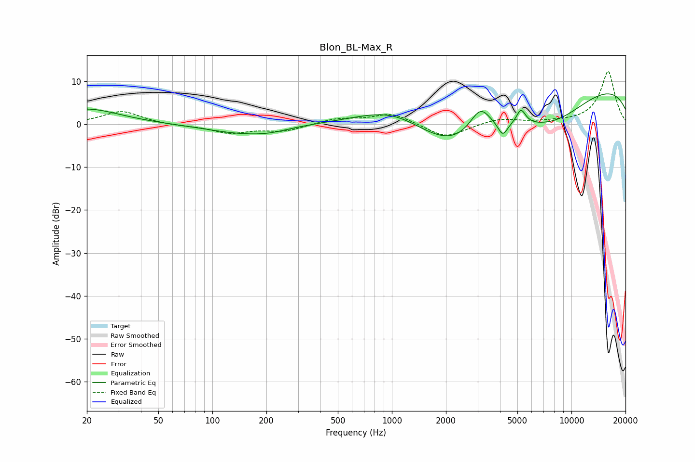

# Blon_BL-Max_R
See [usage instructions](https://github.com/jaakkopasanen/AutoEq#usage) for more options and info.

### Parametric EQs
Apply preamp of -7.1 dB when using parametric equalizer.

|   # | Type    |   Fc (Hz) |    Q |   Gain (dB) |
|-----|---------|-----------|------|-------------|
|   1 | Peaking |        20 | 0.78 |         3.6 |
|   2 | Peaking |       145 | 0.71 |        -2   |
|   3 | Peaking |       208 | 1.35 |        -0.8 |
|   4 | Peaking |      1030 | 0.63 |         7   |
|   5 | Peaking |      2196 | 0.47 |       -11.8 |
|   6 | Peaking |      3110 | 2.25 |         6.6 |
|   7 | Peaking |      4139 | 5.35 |        -3   |
|   8 | Peaking |      5235 | 5.34 |         3.6 |
|   9 | Peaking |      8025 | 0.6  |        -7.1 |
|  10 | Peaking |     10000 | 0.19 |        10.8 |

### Fixed Band EQs
When using fixed band (also called graphic) equalizer, apply preamp of **-12.4 dB** (if available) and set gains manually with these parameters.

|   # | Type    |   Fc (Hz) |    Q |   Gain (dB) |
|-----|---------|-----------|------|-------------|
|   1 | Peaking |        31 | 1.41 |         3   |
|   2 | Peaking |        62 | 1.41 |        -0.3 |
|   3 | Peaking |       125 | 1.41 |        -2   |
|   4 | Peaking |       250 | 1.41 |        -1.6 |
|   5 | Peaking |       500 | 1.41 |         1.3 |
|   6 | Peaking |      1000 | 1.41 |         2.6 |
|   7 | Peaking |      2000 | 1.41 |        -3.3 |
|   8 | Peaking |      4000 | 1.41 |         1.3 |
|   9 | Peaking |      8000 | 1.41 |         0.3 |
|  10 | Peaking |     16000 | 1.41 |        12.3 |

### Graphs

