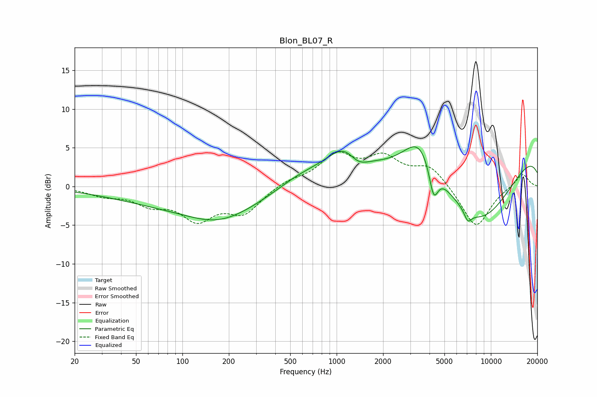

# Blon_BL07_R
See [usage instructions](https://github.com/jaakkopasanen/AutoEq#usage) for more options and info.

### Parametric EQs
Apply preamp of -5.2 dB when using parametric equalizer.

|   # | Type    |   Fc (Hz) |    Q |   Gain (dB) |
|-----|---------|-----------|------|-------------|
|   1 | Peaking |       163 | 0.22 |        -2.7 |
|   2 | Peaking |       171 | 0.72 |        -2   |
|   3 | Peaking |       583 | 0.75 |         2.4 |
|   4 | Peaking |      1185 | 1.17 |         5.2 |
|   5 | Peaking |      1355 | 1.86 |        -2.8 |
|   6 | Peaking |      3456 | 1.34 |         5   |
|   7 | Peaking |      4253 | 4.83 |        -4.1 |
|   8 | Peaking |      7097 | 5.74 |        -1.3 |
|   9 | Peaking |      8376 | 0.48 |       -10.8 |
|  10 | Peaking |     10000 | 0.18 |         6.7 |

### Fixed Band EQs
When using fixed band (also called graphic) equalizer, apply preamp of **-4.6 dB** (if available) and set gains manually with these parameters.

|   # | Type    |   Fc (Hz) |    Q |   Gain (dB) |
|-----|---------|-----------|------|-------------|
|   1 | Peaking |        31 | 1.41 |        -1   |
|   2 | Peaking |        62 | 1.41 |        -1.9 |
|   3 | Peaking |       125 | 1.41 |        -3.9 |
|   4 | Peaking |       250 | 1.41 |        -3.2 |
|   5 | Peaking |       500 | 1.41 |         0.8 |
|   6 | Peaking |      1000 | 1.41 |         3.8 |
|   7 | Peaking |      2000 | 1.41 |         3.3 |
|   8 | Peaking |      4000 | 1.41 |         2.6 |
|   9 | Peaking |      8000 | 1.41 |        -5.5 |
|  10 | Peaking |     16000 | 1.41 |         1.8 |

### Graphs

