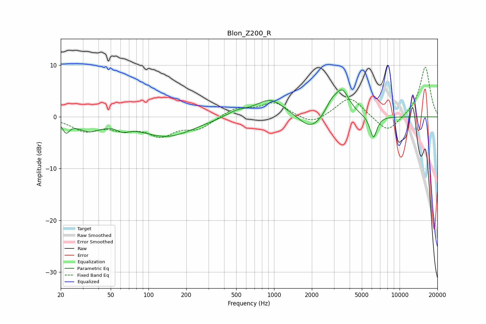

# Blon_Z200_R
See [usage instructions](https://github.com/jaakkopasanen/AutoEq#usage) for more options and info.

### Parametric EQs
Apply preamp of -5.3 dB when using parametric equalizer.

|   # | Type    |   Fc (Hz) |    Q |   Gain (dB) |
|-----|---------|-----------|------|-------------|
|   1 | Peaking |        22 | 5.14 |        -2.1 |
|   2 | Peaking |        34 | 1.51 |        -2.2 |
|   3 | Peaking |        63 | 3.1  |        -1   |
|   4 | Peaking |       140 | 0.66 |        -3.7 |
|   5 | Peaking |       503 | 1.6  |         1.1 |
|   6 | Peaking |       936 | 1.24 |         3.5 |
|   7 | Peaking |      1965 | 1.54 |        -2.9 |
|   8 | Peaking |      2855 | 3.18 |         1.9 |
|   9 | Peaking |      3484 | 2.36 |         5.1 |
|  10 | Peaking |      6187 | 4.87 |        -4.3 |

### Fixed Band EQs
When using fixed band (also called graphic) equalizer, apply preamp of **-9.7 dB** (if available) and set gains manually with these parameters.

|   # | Type    |   Fc (Hz) |    Q |   Gain (dB) |
|-----|---------|-----------|------|-------------|
|   1 | Peaking |        31 | 1.41 |        -2.5 |
|   2 | Peaking |        62 | 1.41 |        -1.9 |
|   3 | Peaking |       125 | 1.41 |        -3.3 |
|   4 | Peaking |       250 | 1.41 |        -2.1 |
|   5 | Peaking |       500 | 1.41 |         1.7 |
|   6 | Peaking |      1000 | 1.41 |         2.7 |
|   7 | Peaking |      2000 | 1.41 |        -1.7 |
|   8 | Peaking |      4000 | 1.41 |         4   |
|   9 | Peaking |      8000 | 1.41 |        -3.3 |
|  10 | Peaking |     16000 | 1.41 |         9.8 |

### Graphs

