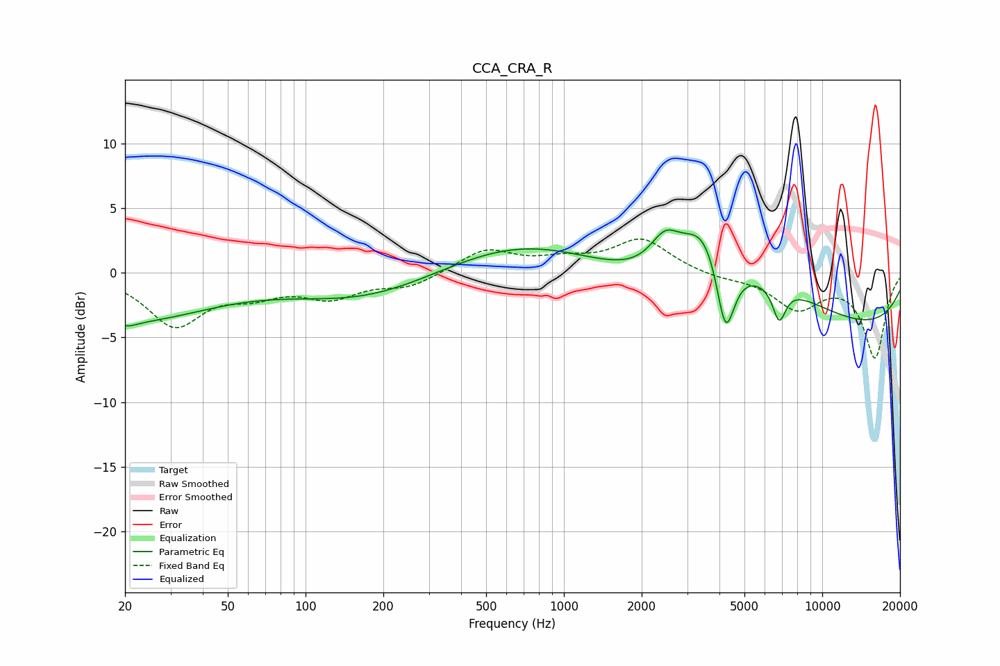

# CCA_CRA_R
See [usage instructions](https://github.com/jaakkopasanen/AutoEq#usage) for more options and info.

### Parametric EQs
Apply preamp of -3.4 dB when using parametric equalizer.

|   # | Type    |   Fc (Hz) |    Q |   Gain (dB) |
|-----|---------|-----------|------|-------------|
|   1 | Peaking |        20 | 0.44 |        -3.6 |
|   2 | Peaking |        21 | 3.95 |        -0.4 |
|   3 | Peaking |       171 | 0.5  |        -2.1 |
|   4 | Peaking |       697 | 0.46 |         2.6 |
|   5 | Peaking |      2461 | 2.46 |         2.5 |
|   6 | Peaking |      3491 | 1.52 |         4.7 |
|   7 | Peaking |      4220 | 3.92 |        -6.1 |
|   8 | Peaking |      6095 | 0.58 |         3.2 |
|   9 | Peaking |      6813 | 5.29 |        -2.7 |
|  10 | Peaking |      9410 | 0.19 |        -4.8 |

### Fixed Band EQs
When using fixed band (also called graphic) equalizer, apply preamp of **-2.7 dB** (if available) and set gains manually with these parameters.

|   # | Type    |   Fc (Hz) |    Q |   Gain (dB) |
|-----|---------|-----------|------|-------------|
|   1 | Peaking |        31 | 1.41 |        -3.9 |
|   2 | Peaking |        62 | 1.41 |        -1.3 |
|   3 | Peaking |       125 | 1.41 |        -1.7 |
|   4 | Peaking |       250 | 1.41 |        -1   |
|   5 | Peaking |       500 | 1.41 |         1.8 |
|   6 | Peaking |      1000 | 1.41 |         0.8 |
|   7 | Peaking |      2000 | 1.41 |         2.6 |
|   8 | Peaking |      4000 | 1.41 |        -0.4 |
|   9 | Peaking |      8000 | 1.41 |        -2.6 |
|  10 | Peaking |     16000 | 1.41 |        -6.5 |

### Graphs

