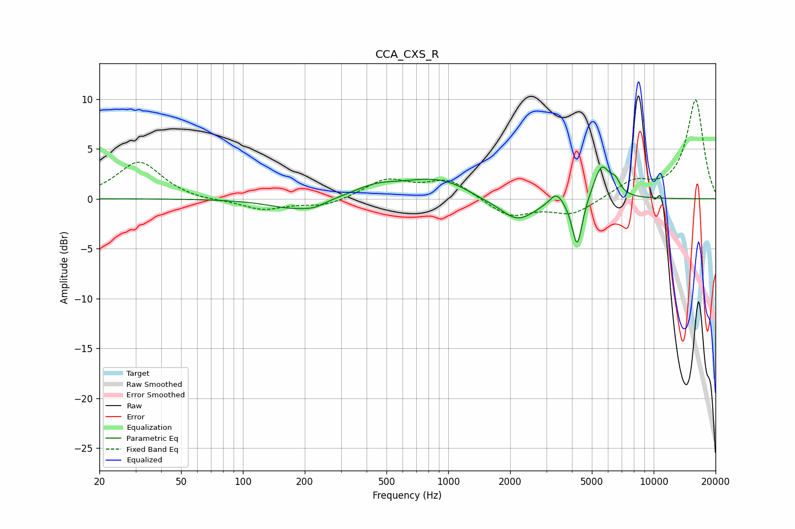

# CCA_CXS_R
See [usage instructions](https://github.com/jaakkopasanen/AutoEq#usage) for more options and info.

### Parametric EQs
Apply preamp of -3.3 dB when using parametric equalizer.

|   # | Type    |   Fc (Hz) |    Q |   Gain (dB) |
|-----|---------|-----------|------|-------------|
|   1 | Peaking |       178 | 1.09 |        -1.1 |
|   2 | Peaking |       223 | 2.74 |        -0.4 |
|   3 | Peaking |       442 | 1.32 |         0.9 |
|   4 | Peaking |       890 | 0.76 |         2   |
|   5 | Peaking |      1401 | 2    |        -0.3 |
|   6 | Peaking |      2164 | 1.56 |        -2.5 |
|   7 | Peaking |      3359 | 4.44 |         1.2 |
|   8 | Peaking |      4243 | 5.57 |        -5   |
|   9 | Peaking |      5578 | 3.45 |         3.4 |
|  10 | Peaking |      6502 | 5.81 |         1.1 |

### Fixed Band EQs
When using fixed band (also called graphic) equalizer, apply preamp of **-10.0 dB** (if available) and set gains manually with these parameters.

|   # | Type    |   Fc (Hz) |    Q |   Gain (dB) |
|-----|---------|-----------|------|-------------|
|   1 | Peaking |        31 | 1.41 |         3.7 |
|   2 | Peaking |        62 | 1.41 |        -0.2 |
|   3 | Peaking |       125 | 1.41 |        -1.1 |
|   4 | Peaking |       250 | 1.41 |        -0.8 |
|   5 | Peaking |       500 | 1.41 |         1.9 |
|   6 | Peaking |      1000 | 1.41 |         1.9 |
|   7 | Peaking |      2000 | 1.41 |        -1.8 |
|   8 | Peaking |      4000 | 1.41 |        -1.6 |
|   9 | Peaking |      8000 | 1.41 |         1.6 |
|  10 | Peaking |     16000 | 1.41 |         9.9 |

### Graphs

