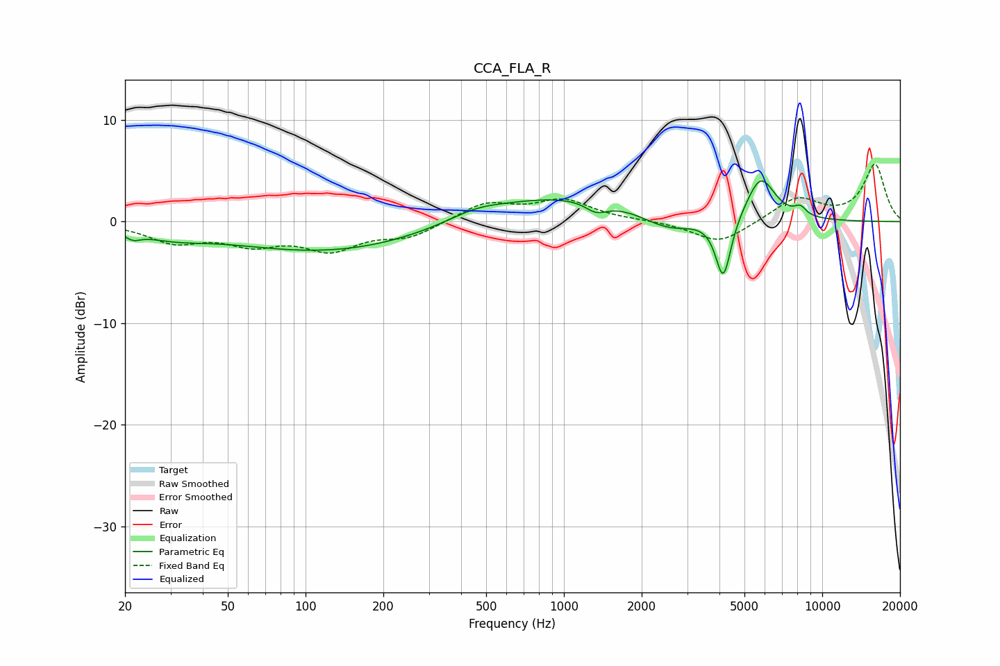

# CCA_FLA_R
See [usage instructions](https://github.com/jaakkopasanen/AutoEq#usage) for more options and info.

### Parametric EQs
Apply preamp of -4.1 dB when using parametric equalizer.

|   # | Type    |   Fc (Hz) |    Q |   Gain (dB) |
|-----|---------|-----------|------|-------------|
|   1 | Peaking |        21 | 4.71 |        -0.7 |
|   2 | Peaking |        30 | 1.09 |        -0.9 |
|   3 | Peaking |       126 | 0.36 |        -3   |
|   4 | Peaking |       455 | 1.39 |         0.7 |
|   5 | Peaking |       998 | 0.41 |         2.7 |
|   6 | Peaking |      1336 | 3.26 |        -1.1 |
|   7 | Peaking |      2534 | 1.26 |        -1.9 |
|   8 | Peaking |      4141 | 4.68 |        -6.2 |
|   9 | Peaking |      5777 | 2.47 |         4.3 |
|  10 | Peaking |      8227 | 5.78 |         0.8 |

### Fixed Band EQs
When using fixed band (also called graphic) equalizer, apply preamp of **-5.7 dB** (if available) and set gains manually with these parameters.

|   # | Type    |   Fc (Hz) |    Q |   Gain (dB) |
|-----|---------|-----------|------|-------------|
|   1 | Peaking |        31 | 1.41 |        -1.8 |
|   2 | Peaking |        62 | 1.41 |        -1.9 |
|   3 | Peaking |       125 | 1.41 |        -2.5 |
|   4 | Peaking |       250 | 1.41 |        -1.4 |
|   5 | Peaking |       500 | 1.41 |         1.8 |
|   6 | Peaking |      1000 | 1.41 |         2   |
|   7 | Peaking |      2000 | 1.41 |         0.1 |
|   8 | Peaking |      4000 | 1.41 |        -2.2 |
|   9 | Peaking |      8000 | 1.41 |         2.3 |
|  10 | Peaking |     16000 | 1.41 |         5.6 |

### Graphs

