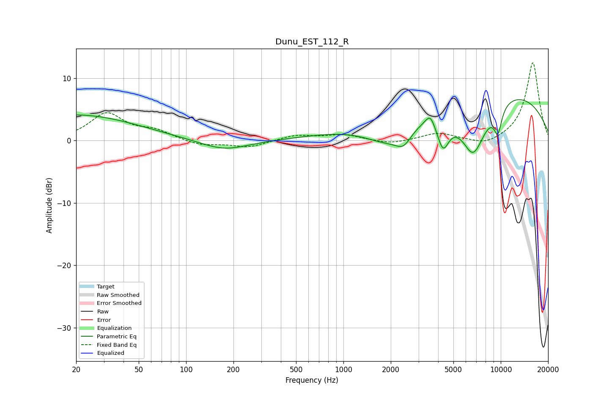

# Dunu_EST_112_R
See [usage instructions](https://github.com/jaakkopasanen/AutoEq#usage) for more options and info.

### Parametric EQs
Apply preamp of -6.7 dB when using parametric equalizer.

|   # | Type    |   Fc (Hz) |    Q |   Gain (dB) |
|-----|---------|-----------|------|-------------|
|   1 | Peaking |        20 | 0.36 |         4.1 |
|   2 | Peaking |       174 | 0.93 |        -1.7 |
|   3 | Peaking |      1958 | 0.8  |        -5.6 |
|   4 | Peaking |      2416 | 2.7  |        -2.3 |
|   5 | Peaking |      3562 | 5.1  |         1.7 |
|   6 | Peaking |      4298 | 3.63 |        -5   |
|   7 | Peaking |      6028 | 2.89 |         0.8 |
|   8 | Peaking |      6598 | 1.47 |       -10.5 |
|   9 | Peaking |      6660 | 0.18 |         9.4 |
|  10 | Peaking |      9593 | 4.83 |        -4   |

### Fixed Band EQs
When using fixed band (also called graphic) equalizer, apply preamp of **-12.6 dB** (if available) and set gains manually with these parameters.

|   # | Type    |   Fc (Hz) |    Q |   Gain (dB) |
|-----|---------|-----------|------|-------------|
|   1 | Peaking |        31 | 1.41 |         4.2 |
|   2 | Peaking |        62 | 1.41 |         1.4 |
|   3 | Peaking |       125 | 1.41 |        -0.8 |
|   4 | Peaking |       250 | 1.41 |        -1.1 |
|   5 | Peaking |       500 | 1.41 |         0.9 |
|   6 | Peaking |      1000 | 1.41 |         0.9 |
|   7 | Peaking |      2000 | 1.41 |        -0.6 |
|   8 | Peaking |      4000 | 1.41 |         1.2 |
|   9 | Peaking |      8000 | 1.41 |        -1   |
|  10 | Peaking |     16000 | 1.41 |        12.6 |

### Graphs

