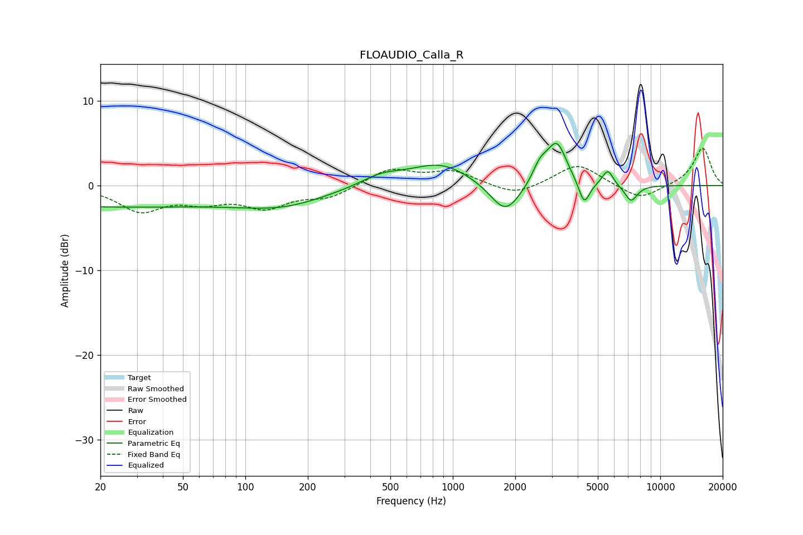

# FLOAUDIO_Calla_R
See [usage instructions](https://github.com/jaakkopasanen/AutoEq#usage) for more options and info.

### Parametric EQs
Apply preamp of -5.1 dB when using parametric equalizer.

|   # | Type    |   Fc (Hz) |    Q |   Gain (dB) |
|-----|---------|-----------|------|-------------|
|   1 | Peaking |        20 | 0.19 |        -2.4 |
|   2 | Peaking |       154 | 0.66 |        -1.8 |
|   3 | Peaking |       453 | 1.37 |         1.2 |
|   4 | Peaking |       872 | 0.98 |         2.6 |
|   5 | Peaking |      1792 | 1.94 |        -3.8 |
|   6 | Peaking |      2634 | 3.81 |         2   |
|   7 | Peaking |      3173 | 2.98 |         4.9 |
|   8 | Peaking |      4299 | 5.32 |        -2.9 |
|   9 | Peaking |      5584 | 5.36 |         1.8 |
|  10 | Peaking |      7229 | 4.34 |        -1.9 |

### Fixed Band EQs
When using fixed band (also called graphic) equalizer, apply preamp of **-4.5 dB** (if available) and set gains manually with these parameters.

|   # | Type    |   Fc (Hz) |    Q |   Gain (dB) |
|-----|---------|-----------|------|-------------|
|   1 | Peaking |        31 | 1.41 |        -2.8 |
|   2 | Peaking |        62 | 1.41 |        -1.6 |
|   3 | Peaking |       125 | 1.41 |        -2.3 |
|   4 | Peaking |       250 | 1.41 |        -1.3 |
|   5 | Peaking |       500 | 1.41 |         2   |
|   6 | Peaking |      1000 | 1.41 |         1.6 |
|   7 | Peaking |      2000 | 1.41 |        -1.3 |
|   8 | Peaking |      4000 | 1.41 |         2.6 |
|   9 | Peaking |      8000 | 1.41 |        -1.7 |
|  10 | Peaking |     16000 | 1.41 |         4.5 |

### Graphs

