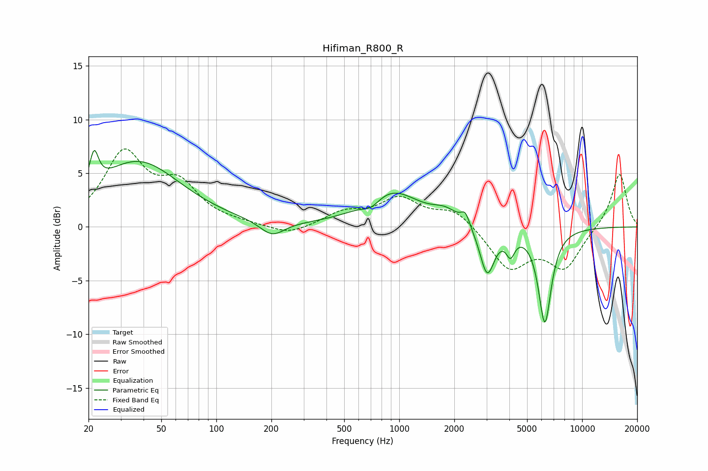

# Hifiman_R800_R
See [usage instructions](https://github.com/jaakkopasanen/AutoEq#usage) for more options and info.

### Parametric EQs
Apply preamp of -7.2 dB when using parametric equalizer.

|   # | Type    |   Fc (Hz) |    Q |   Gain (dB) |
|-----|---------|-----------|------|-------------|
|   1 | Peaking |        21 | 6    |         3.1 |
|   2 | Peaking |        37 | 0.61 |         6   |
|   3 | Peaking |       202 | 2.13 |        -1.4 |
|   4 | Peaking |       704 | 2.91 |        -0.9 |
|   5 | Peaking |       904 | 0.95 |         3.3 |
|   6 | Peaking |      1795 | 2.04 |         1   |
|   7 | Peaking |      2299 | 5.99 |         1.2 |
|   8 | Peaking |      3027 | 3.54 |        -4.5 |
|   9 | Peaking |      4057 | 6    |        -1.8 |
|  10 | Peaking |      6255 | 3.88 |        -8.8 |

### Fixed Band EQs
When using fixed band (also called graphic) equalizer, apply preamp of **-7.4 dB** (if available) and set gains manually with these parameters.

|   # | Type    |   Fc (Hz) |    Q |   Gain (dB) |
|-----|---------|-----------|------|-------------|
|   1 | Peaking |        31 | 1.41 |         6.6 |
|   2 | Peaking |        62 | 1.41 |         3.5 |
|   3 | Peaking |       125 | 1.41 |         0.2 |
|   4 | Peaking |       250 | 1.41 |        -0.8 |
|   5 | Peaking |       500 | 1.41 |         1.2 |
|   6 | Peaking |      1000 | 1.41 |         2.5 |
|   7 | Peaking |      2000 | 1.41 |         1.6 |
|   8 | Peaking |      4000 | 1.41 |        -3.8 |
|   9 | Peaking |      8000 | 1.41 |        -3.7 |
|  10 | Peaking |     16000 | 1.41 |         5.1 |

### Graphs

