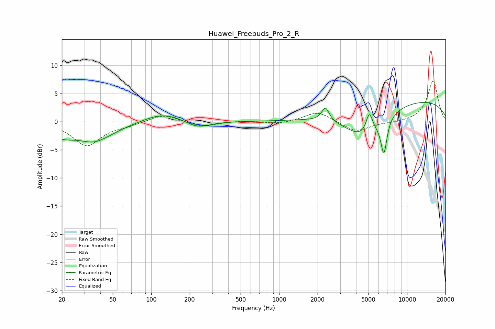

# Huawei_Freebuds_Pro_2_R
See [usage instructions](https://github.com/jaakkopasanen/AutoEq#usage) for more options and info.

### Parametric EQs
Apply preamp of -3.5 dB when using parametric equalizer.

|   # | Type    |   Fc (Hz) |    Q |   Gain (dB) |
|-----|---------|-----------|------|-------------|
|   1 | Peaking |        20 | 1.52 |        -1.7 |
|   2 | Peaking |        36 | 1.58 |        -0.7 |
|   3 | Peaking |        36 | 0.82 |        -2.6 |
|   4 | Peaking |       123 | 0.94 |         1.7 |
|   5 | Peaking |       231 | 1.52 |        -1.3 |
|   6 | Peaking |      2303 | 4.98 |         2.5 |
|   7 | Peaking |      4590 | 0.9  |        -5.6 |
|   8 | Peaking |      5079 | 5.33 |         3.6 |
|   9 | Peaking |      6597 | 5.67 |        -6.2 |
|  10 | Peaking |     10000 | 0.22 |         4.1 |

### Fixed Band EQs
When using fixed band (also called graphic) equalizer, apply preamp of **-7.3 dB** (if available) and set gains manually with these parameters.

|   # | Type    |   Fc (Hz) |    Q |   Gain (dB) |
|-----|---------|-----------|------|-------------|
|   1 | Peaking |        31 | 1.41 |        -4.2 |
|   2 | Peaking |        62 | 1.41 |        -0.6 |
|   3 | Peaking |       125 | 1.41 |         1.4 |
|   4 | Peaking |       250 | 1.41 |        -0.9 |
|   5 | Peaking |       500 | 1.41 |         0.2 |
|   6 | Peaking |      1000 | 1.41 |        -0.4 |
|   7 | Peaking |      2000 | 1.41 |         1.8 |
|   8 | Peaking |      4000 | 1.41 |        -1.9 |
|   9 | Peaking |      8000 | 1.41 |        -0.2 |
|  10 | Peaking |     16000 | 1.41 |         7.3 |

### Graphs

