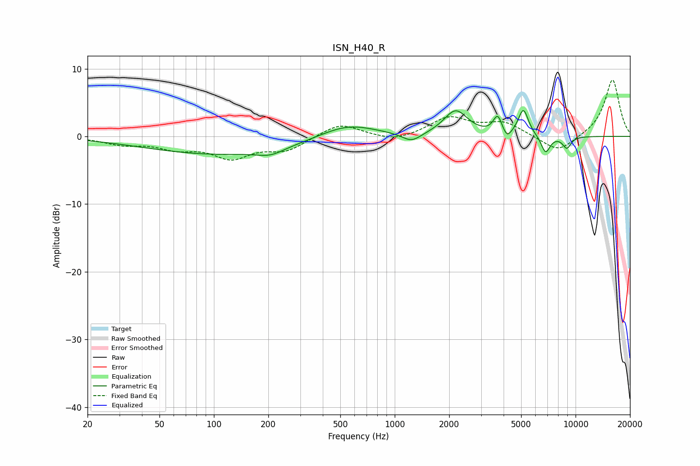

# ISN_H40_R
See [usage instructions](https://github.com/jaakkopasanen/AutoEq#usage) for more options and info.

### Parametric EQs
Apply preamp of -3.9 dB when using parametric equalizer.

|   # | Type    |   Fc (Hz) |    Q |   Gain (dB) |
|-----|---------|-----------|------|-------------|
|   1 | Peaking |       109 | 0.34 |        -2.6 |
|   2 | Peaking |       206 | 1.89 |        -1   |
|   3 | Peaking |       547 | 0.9  |         2.1 |
|   4 | Peaking |      1239 | 2.6  |        -1.4 |
|   5 | Peaking |      2175 | 2.17 |         3.7 |
|   6 | Peaking |      3709 | 5.94 |         2.6 |
|   7 | Peaking |      4180 | 6    |        -1.3 |
|   8 | Peaking |      5146 | 5.02 |         3.9 |
|   9 | Peaking |      6829 | 5.5  |        -2.6 |
|  10 | Peaking |      8947 | 5.49 |        -1.7 |

### Fixed Band EQs
When using fixed band (also called graphic) equalizer, apply preamp of **-8.4 dB** (if available) and set gains manually with these parameters.

|   # | Type    |   Fc (Hz) |    Q |   Gain (dB) |
|-----|---------|-----------|------|-------------|
|   1 | Peaking |        31 | 1.41 |        -1   |
|   2 | Peaking |        62 | 1.41 |        -1.5 |
|   3 | Peaking |       125 | 1.41 |        -2.9 |
|   4 | Peaking |       250 | 1.41 |        -1.9 |
|   5 | Peaking |       500 | 1.41 |         2   |
|   6 | Peaking |      1000 | 1.41 |        -0.9 |
|   7 | Peaking |      2000 | 1.41 |         2.7 |
|   8 | Peaking |      4000 | 1.41 |         1.9 |
|   9 | Peaking |      8000 | 1.41 |        -2.5 |
|  10 | Peaking |     16000 | 1.41 |         8.5 |

### Graphs

