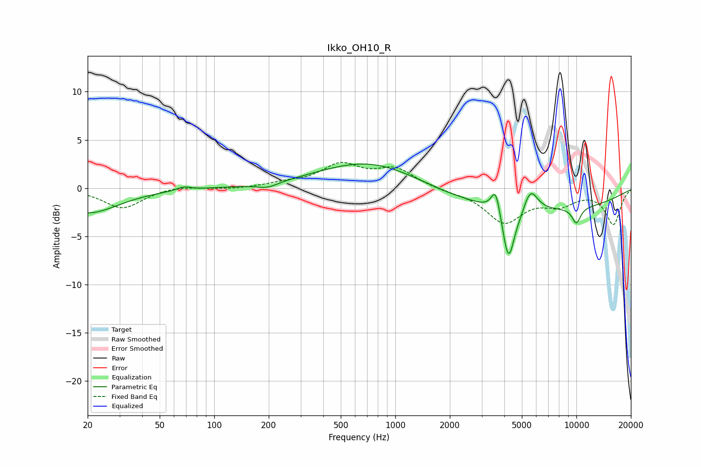

# Ikko_OH10_R
See [usage instructions](https://github.com/jaakkopasanen/AutoEq#usage) for more options and info.

### Parametric EQs
Apply preamp of -2.6 dB when using parametric equalizer.

|   # | Type    |   Fc (Hz) |    Q |   Gain (dB) |
|-----|---------|-----------|------|-------------|
|   1 | Peaking |        20 | 0.83 |        -2.6 |
|   2 | Peaking |        68 | 3.88 |         0.4 |
|   3 | Peaking |       197 | 2.33 |        -0.6 |
|   4 | Peaking |       760 | 0.49 |         3.1 |
|   5 | Peaking |      3588 | 5.74 |         2.6 |
|   6 | Peaking |      4220 | 4.24 |        -5.7 |
|   7 | Peaking |      4900 | 5.99 |        -0.3 |
|   8 | Peaking |      5362 | 0.21 |        -2.3 |
|   9 | Peaking |      5587 | 3.55 |         2.3 |
|  10 | Peaking |     10000 | 5.1  |        -1.6 |

### Fixed Band EQs
When using fixed band (also called graphic) equalizer, apply preamp of **-2.8 dB** (if available) and set gains manually with these parameters.

|   # | Type    |   Fc (Hz) |    Q |   Gain (dB) |
|-----|---------|-----------|------|-------------|
|   1 | Peaking |        31 | 1.41 |        -2.1 |
|   2 | Peaking |        62 | 1.41 |         0.3 |
|   3 | Peaking |       125 | 1.41 |        -0.1 |
|   4 | Peaking |       250 | 1.41 |         0.4 |
|   5 | Peaking |       500 | 1.41 |         2.3 |
|   6 | Peaking |      1000 | 1.41 |         1.9 |
|   7 | Peaking |      2000 | 1.41 |        -0.3 |
|   8 | Peaking |      4000 | 1.41 |        -3.4 |
|   9 | Peaking |      8000 | 1.41 |        -1.5 |
|  10 | Peaking |     16000 | 1.41 |        -3.7 |

### Graphs

