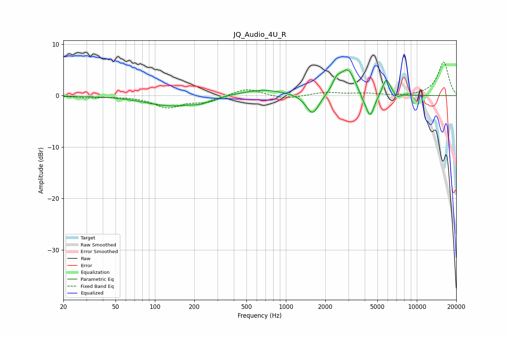

# JQ_Audio_4U_R
See [usage instructions](https://github.com/jaakkopasanen/AutoEq#usage) for more options and info.

### Parametric EQs
Apply preamp of -5.1 dB when using parametric equalizer.

|   # | Type    |   Fc (Hz) |    Q |   Gain (dB) |
|-----|---------|-----------|------|-------------|
|   1 | Peaking |       133 | 0.73 |        -2   |
|   2 | Peaking |       225 | 2.11 |        -0.7 |
|   3 | Peaking |       660 | 0.81 |         1.3 |
|   4 | Peaking |      1600 | 2.83 |        -4.1 |
|   5 | Peaking |      2440 | 4.38 |         1.9 |
|   6 | Peaking |      2970 | 2.41 |         5.1 |
|   7 | Peaking |      3873 | 4.01 |        -0.8 |
|   8 | Peaking |      4399 | 4.16 |        -4.7 |
|   9 | Peaking |      5850 | 4.46 |         3.4 |
|  10 | Peaking |      7050 | 5.75 |        -0.8 |

### Fixed Band EQs
When using fixed band (also called graphic) equalizer, apply preamp of **-6.6 dB** (if available) and set gains manually with these parameters.

|   # | Type    |   Fc (Hz) |    Q |   Gain (dB) |
|-----|---------|-----------|------|-------------|
|   1 | Peaking |        31 | 1.41 |        -0.3 |
|   2 | Peaking |        62 | 1.41 |        -0.1 |
|   3 | Peaking |       125 | 1.41 |        -2.2 |
|   4 | Peaking |       250 | 1.41 |        -1.2 |
|   5 | Peaking |       500 | 1.41 |         1.5 |
|   6 | Peaking |      1000 | 1.41 |        -0.7 |
|   7 | Peaking |      2000 | 1.41 |         0.6 |
|   8 | Peaking |      4000 | 1.41 |         0.4 |
|   9 | Peaking |      8000 | 1.41 |        -0.2 |
|  10 | Peaking |     16000 | 1.41 |         6.6 |

### Graphs

