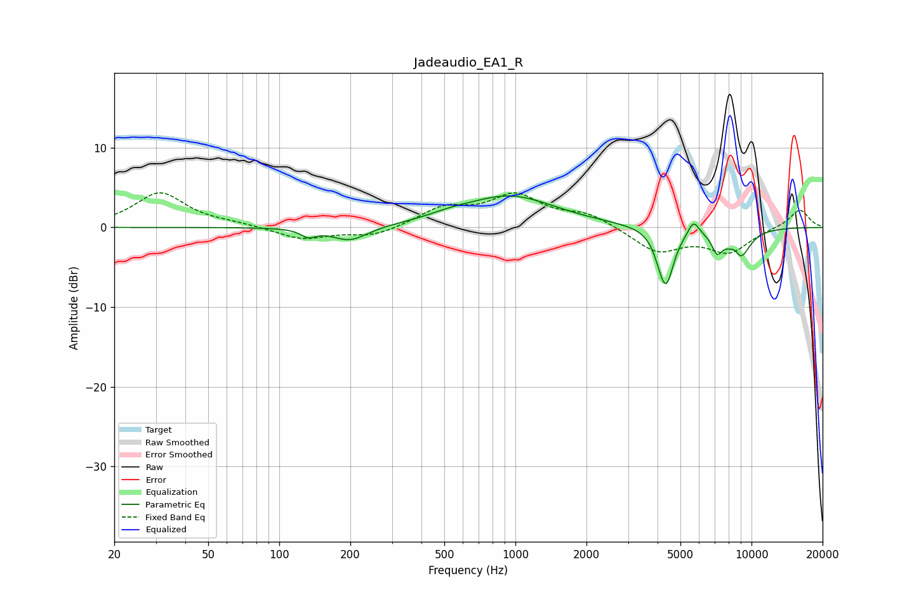

# Jadeaudio_EA1_R
See [usage instructions](https://github.com/jaakkopasanen/AutoEq#usage) for more options and info.

### Parametric EQs
Apply preamp of -4.0 dB when using parametric equalizer.

|   # | Type    |   Fc (Hz) |    Q |   Gain (dB) |
|-----|---------|-----------|------|-------------|
|   1 | Peaking |       133 | 4.57 |        -0.9 |
|   2 | Peaking |       199 | 1.87 |        -1.8 |
|   3 | Peaking |       526 | 1.64 |         0.5 |
|   4 | Peaking |       946 | 0.73 |         3.9 |
|   5 | Peaking |      4069 | 6    |        -0.8 |
|   6 | Peaking |      4347 | 4.28 |        -6.9 |
|   7 | Peaking |      5680 | 5.99 |         1.8 |
|   8 | Peaking |      7145 | 5.94 |        -2.3 |
|   9 | Peaking |      8549 | 5.97 |         1.4 |
|  10 | Peaking |      8828 | 2.92 |        -4.3 |

### Fixed Band EQs
When using fixed band (also called graphic) equalizer, apply preamp of **-4.4 dB** (if available) and set gains manually with these parameters.

|   # | Type    |   Fc (Hz) |    Q |   Gain (dB) |
|-----|---------|-----------|------|-------------|
|   1 | Peaking |        31 | 1.41 |         4.3 |
|   2 | Peaking |        62 | 1.41 |         0.4 |
|   3 | Peaking |       125 | 1.41 |        -1.5 |
|   4 | Peaking |       250 | 1.41 |        -1.1 |
|   5 | Peaking |       500 | 1.41 |         2.3 |
|   6 | Peaking |      1000 | 1.41 |         3.8 |
|   7 | Peaking |      2000 | 1.41 |         1.6 |
|   8 | Peaking |      4000 | 1.41 |        -3   |
|   9 | Peaking |      8000 | 1.41 |        -3   |
|  10 | Peaking |     16000 | 1.41 |         2.3 |

### Graphs

