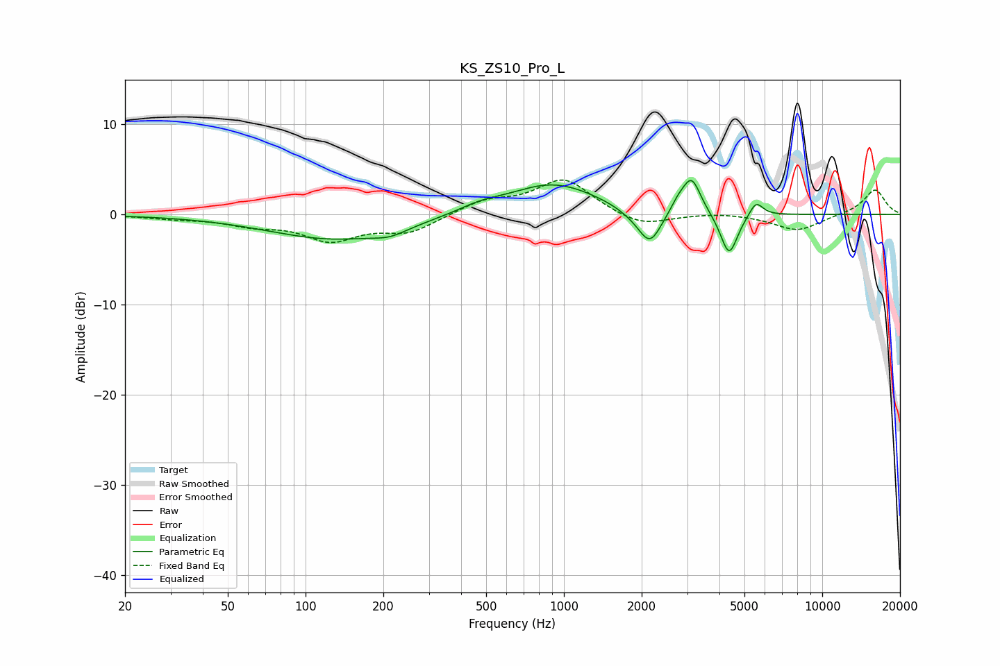

# KS_ZS10_Pro_L
See [usage instructions](https://github.com/jaakkopasanen/AutoEq#usage) for more options and info.

### Parametric EQs
Apply preamp of -3.9 dB when using parametric equalizer.

|   # | Type    |   Fc (Hz) |    Q |   Gain (dB) |
|-----|---------|-----------|------|-------------|
|   1 | Peaking |       131 | 0.54 |        -2.8 |
|   2 | Peaking |       212 | 2.25 |        -0.7 |
|   3 | Peaking |       469 | 1.68 |         0.7 |
|   4 | Peaking |       906 | 0.8  |         3.5 |
|   5 | Peaking |      1852 | 2.11 |        -0.6 |
|   6 | Peaking |      2154 | 3.16 |        -3.7 |
|   7 | Peaking |      2764 | 4.82 |         1   |
|   8 | Peaking |      3120 | 3.97 |         4   |
|   9 | Peaking |      4359 | 4.25 |        -4.8 |
|  10 | Peaking |      5542 | 5.25 |         1.7 |

### Fixed Band EQs
When using fixed band (also called graphic) equalizer, apply preamp of **-3.9 dB** (if available) and set gains manually with these parameters.

|   # | Type    |   Fc (Hz) |    Q |   Gain (dB) |
|-----|---------|-----------|------|-------------|
|   1 | Peaking |        31 | 1.41 |        -0.4 |
|   2 | Peaking |        62 | 1.41 |        -1   |
|   3 | Peaking |       125 | 1.41 |        -2.7 |
|   4 | Peaking |       250 | 1.41 |        -1.9 |
|   5 | Peaking |       500 | 1.41 |         1.4 |
|   6 | Peaking |      1000 | 1.41 |         3.9 |
|   7 | Peaking |      2000 | 1.41 |        -1.4 |
|   8 | Peaking |      4000 | 1.41 |         0.2 |
|   9 | Peaking |      8000 | 1.41 |        -1.8 |
|  10 | Peaking |     16000 | 1.41 |         2.8 |

### Graphs

