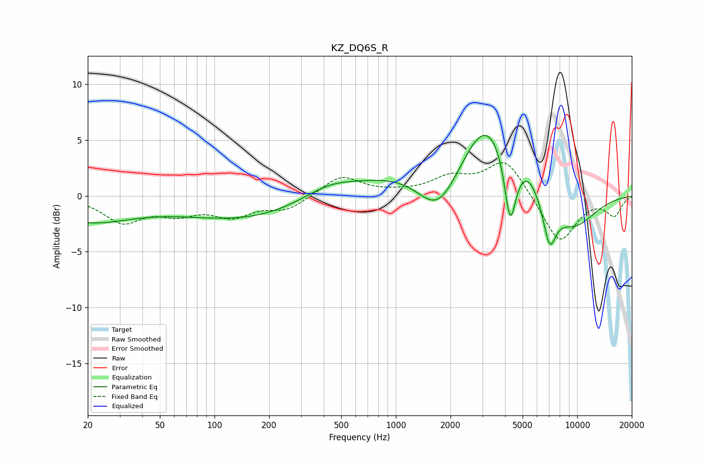

# KZ_DQ6S_R
See [usage instructions](https://github.com/jaakkopasanen/AutoEq#usage) for more options and info.

### Parametric EQs
Apply preamp of -5.5 dB when using parametric equalizer.

|   # | Type    |   Fc (Hz) |    Q |   Gain (dB) |
|-----|---------|-----------|------|-------------|
|   1 | Peaking |        20 | 0.56 |        -2.2 |
|   2 | Peaking |       148 | 0.39 |        -2   |
|   3 | Peaking |       432 | 0.89 |         1.4 |
|   4 | Peaking |      1022 | 0.66 |         1.5 |
|   5 | Peaking |      1713 | 1.28 |        -3.8 |
|   6 | Peaking |      3175 | 0.97 |         7   |
|   7 | Peaking |      4269 | 4.43 |        -6.1 |
|   8 | Peaking |      5425 | 2.36 |         1.1 |
|   9 | Peaking |      7037 | 3.74 |        -3.9 |
|  10 | Peaking |      9402 | 0.93 |        -3   |

### Fixed Band EQs
When using fixed band (also called graphic) equalizer, apply preamp of **-3.1 dB** (if available) and set gains manually with these parameters.

|   # | Type    |   Fc (Hz) |    Q |   Gain (dB) |
|-----|---------|-----------|------|-------------|
|   1 | Peaking |        31 | 1.41 |        -2.2 |
|   2 | Peaking |        62 | 1.41 |        -1.3 |
|   3 | Peaking |       125 | 1.41 |        -1.6 |
|   4 | Peaking |       250 | 1.41 |        -1.2 |
|   5 | Peaking |       500 | 1.41 |         1.8 |
|   6 | Peaking |      1000 | 1.41 |         0.2 |
|   7 | Peaking |      2000 | 1.41 |         1.5 |
|   8 | Peaking |      4000 | 1.41 |         3.3 |
|   9 | Peaking |      8000 | 1.41 |        -4.3 |
|  10 | Peaking |     16000 | 1.41 |        -1.7 |

### Graphs

