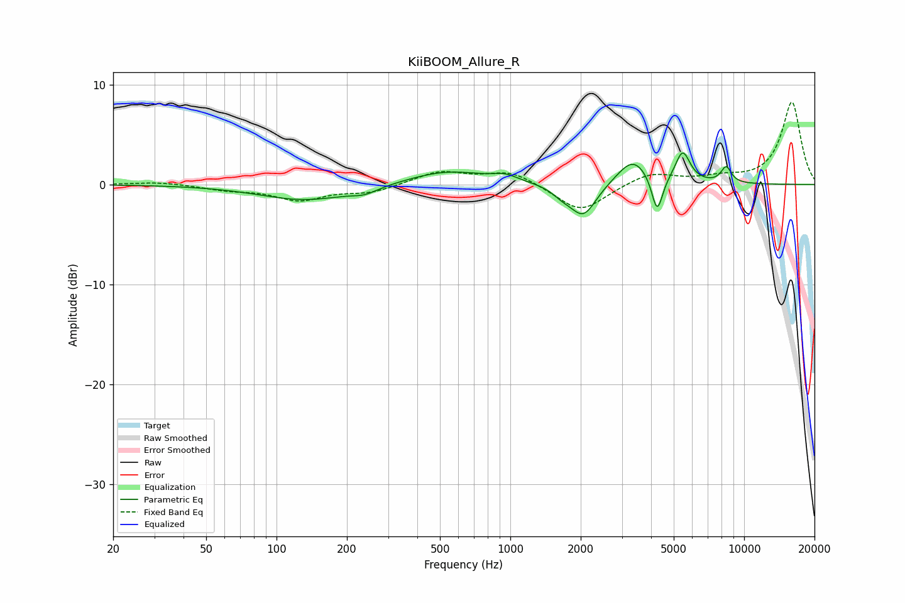

# KiiBOOM_Allure_R
See [usage instructions](https://github.com/jaakkopasanen/AutoEq#usage) for more options and info.

### Parametric EQs
Apply preamp of -3.2 dB when using parametric equalizer.

|   # | Type    |   Fc (Hz) |    Q |   Gain (dB) |
|-----|---------|-----------|------|-------------|
|   1 | Peaking |       133 | 0.72 |        -1.6 |
|   2 | Peaking |       238 | 2.55 |        -0.6 |
|   3 | Peaking |       538 | 0.83 |         1.4 |
|   4 | Peaking |       953 | 2.71 |         0.6 |
|   5 | Peaking |      1668 | 3.22 |        -0.7 |
|   6 | Peaking |      2053 | 2.54 |        -3.3 |
|   7 | Peaking |      3347 | 2.1  |         2.6 |
|   8 | Peaking |      4247 | 6    |        -3.8 |
|   9 | Peaking |      5461 | 4.42 |         3.1 |
|  10 | Peaking |      8377 | 5.82 |         1.6 |

### Fixed Band EQs
When using fixed band (also called graphic) equalizer, apply preamp of **-8.3 dB** (if available) and set gains manually with these parameters.

|   # | Type    |   Fc (Hz) |    Q |   Gain (dB) |
|-----|---------|-----------|------|-------------|
|   1 | Peaking |        31 | 1.41 |         0.3 |
|   2 | Peaking |        62 | 1.41 |        -0.5 |
|   3 | Peaking |       125 | 1.41 |        -1.5 |
|   4 | Peaking |       250 | 1.41 |        -0.8 |
|   5 | Peaking |       500 | 1.41 |         1.3 |
|   6 | Peaking |      1000 | 1.41 |         1.3 |
|   7 | Peaking |      2000 | 1.41 |        -2.8 |
|   8 | Peaking |      4000 | 1.41 |         1.2 |
|   9 | Peaking |      8000 | 1.41 |         0.6 |
|  10 | Peaking |     16000 | 1.41 |         8.2 |

### Graphs

