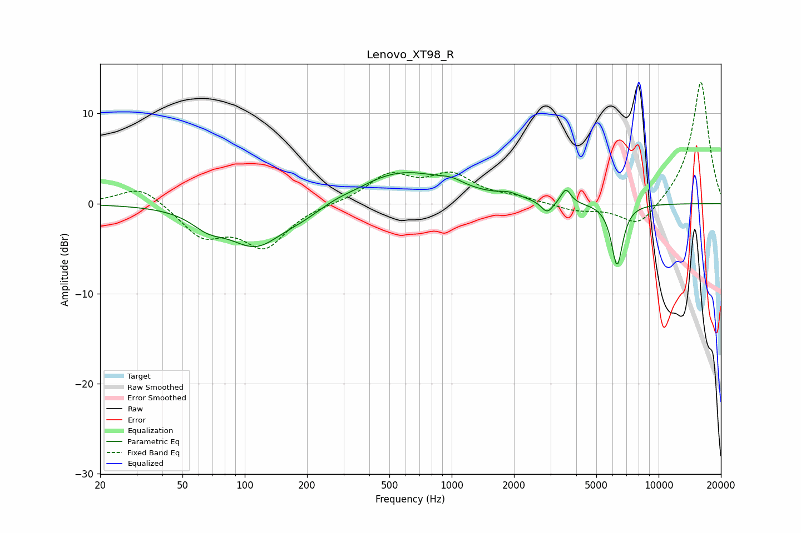

# Lenovo_XT98_R
See [usage instructions](https://github.com/jaakkopasanen/AutoEq#usage) for more options and info.

### Parametric EQs
Apply preamp of -3.5 dB when using parametric equalizer.

|   # | Type    |   Fc (Hz) |    Q |   Gain (dB) |
|-----|---------|-----------|------|-------------|
|   1 | Peaking |        66 | 1.81 |        -1.5 |
|   2 | Peaking |       113 | 1.04 |        -4.6 |
|   3 | Peaking |       193 | 1.47 |        -0.9 |
|   4 | Peaking |       354 | 1.89 |        -0.2 |
|   5 | Peaking |       574 | 0.6  |         3.6 |
|   6 | Peaking |      1000 | 2.65 |         0.6 |
|   7 | Peaking |      1892 | 3.08 |         0.5 |
|   8 | Peaking |      2895 | 4.84 |        -1.4 |
|   9 | Peaking |      3565 | 6    |         1.6 |
|  10 | Peaking |      6298 | 4.98 |        -6.9 |

### Fixed Band EQs
When using fixed band (also called graphic) equalizer, apply preamp of **-13.5 dB** (if available) and set gains manually with these parameters.

|   # | Type    |   Fc (Hz) |    Q |   Gain (dB) |
|-----|---------|-----------|------|-------------|
|   1 | Peaking |        31 | 1.41 |         2.1 |
|   2 | Peaking |        62 | 1.41 |        -3.4 |
|   3 | Peaking |       125 | 1.41 |        -4.6 |
|   4 | Peaking |       250 | 1.41 |         0   |
|   5 | Peaking |       500 | 1.41 |         3   |
|   6 | Peaking |      1000 | 1.41 |         2.9 |
|   7 | Peaking |      2000 | 1.41 |         0.6 |
|   8 | Peaking |      4000 | 1.41 |        -0.8 |
|   9 | Peaking |      8000 | 1.41 |        -2.8 |
|  10 | Peaking |     16000 | 1.41 |        13.7 |

### Graphs

