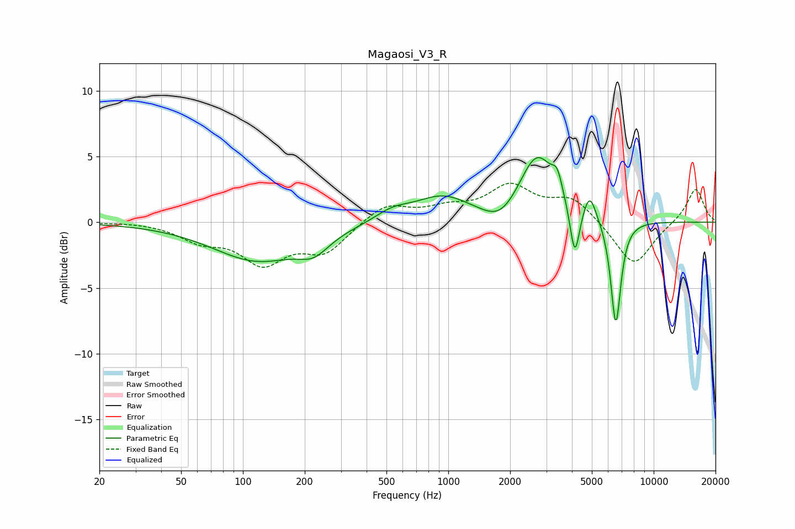

# Magaosi_V3_R
See [usage instructions](https://github.com/jaakkopasanen/AutoEq#usage) for more options and info.

### Parametric EQs
Apply preamp of -5.0 dB when using parametric equalizer.

|   # | Type    |   Fc (Hz) |    Q |   Gain (dB) |
|-----|---------|-----------|------|-------------|
|   1 | Peaking |       118 | 0.65 |        -2.9 |
|   2 | Peaking |       221 | 1.91 |        -1.2 |
|   3 | Peaking |       535 | 1.63 |         0.8 |
|   4 | Peaking |       939 | 1.04 |         1.9 |
|   5 | Peaking |      1804 | 1.66 |        -1.4 |
|   6 | Peaking |      2706 | 1.58 |         5.1 |
|   7 | Peaking |      3392 | 5.8  |         1.4 |
|   8 | Peaking |      4130 | 6    |        -4.1 |
|   9 | Peaking |      4883 | 4.55 |         2   |
|  10 | Peaking |      6542 | 5.47 |        -8.1 |

### Fixed Band EQs
When using fixed band (also called graphic) equalizer, apply preamp of **-3.1 dB** (if available) and set gains manually with these parameters.

|   # | Type    |   Fc (Hz) |    Q |   Gain (dB) |
|-----|---------|-----------|------|-------------|
|   1 | Peaking |        31 | 1.41 |         0.1 |
|   2 | Peaking |        62 | 1.41 |        -1.2 |
|   3 | Peaking |       125 | 1.41 |        -2.9 |
|   4 | Peaking |       250 | 1.41 |        -2.1 |
|   5 | Peaking |       500 | 1.41 |         1.4 |
|   6 | Peaking |      1000 | 1.41 |         0.9 |
|   7 | Peaking |      2000 | 1.41 |         2.6 |
|   8 | Peaking |      4000 | 1.41 |         1.8 |
|   9 | Peaking |      8000 | 1.41 |        -3.4 |
|  10 | Peaking |     16000 | 1.41 |         2.6 |

### Graphs

