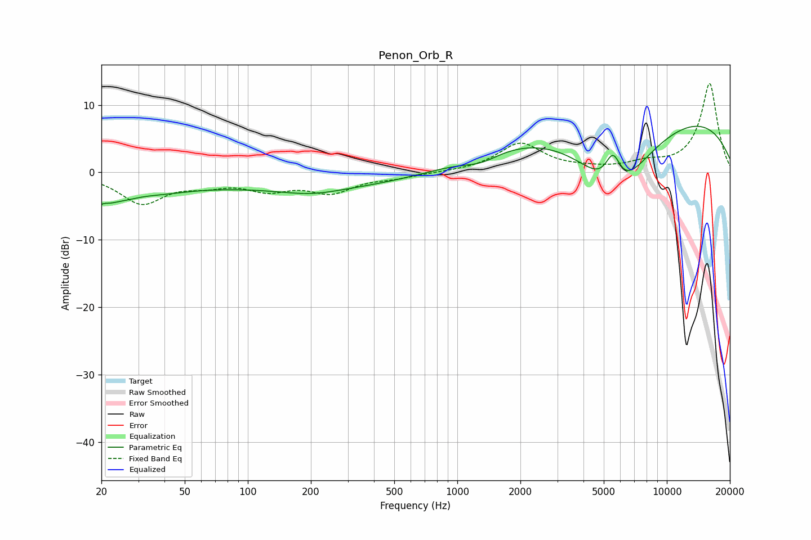

# Penon_Orb_R
See [usage instructions](https://github.com/jaakkopasanen/AutoEq#usage) for more options and info.

### Parametric EQs
Apply preamp of -6.9 dB when using parametric equalizer.

|   # | Type    |   Fc (Hz) |    Q |   Gain (dB) |
|-----|---------|-----------|------|-------------|
|   1 | Peaking |        20 | 4.52 |        -3.1 |
|   2 | Peaking |        20 | 5.69 |         2.3 |
|   3 | Peaking |        24 | 0.59 |        -4   |
|   4 | Peaking |        31 | 1.63 |         0.5 |
|   5 | Peaking |       201 | 1.01 |        -0.9 |
|   6 | Peaking |       277 | 0.23 |        -2.4 |
|   7 | Peaking |      1300 | 1.56 |        -1.4 |
|   8 | Peaking |      5533 | 3.49 |         5.6 |
|   9 | Peaking |      5673 | 0.77 |       -14.3 |
|  10 | Peaking |      6983 | 0.18 |        11.5 |

### Fixed Band EQs
When using fixed band (also called graphic) equalizer, apply preamp of **-13.3 dB** (if available) and set gains manually with these parameters.

|   # | Type    |   Fc (Hz) |    Q |   Gain (dB) |
|-----|---------|-----------|------|-------------|
|   1 | Peaking |        31 | 1.41 |        -4.4 |
|   2 | Peaking |        62 | 1.41 |        -1.4 |
|   3 | Peaking |       125 | 1.41 |        -2.2 |
|   4 | Peaking |       250 | 1.41 |        -2.7 |
|   5 | Peaking |       500 | 1.41 |        -0.7 |
|   6 | Peaking |      1000 | 1.41 |         0   |
|   7 | Peaking |      2000 | 1.41 |         4.3 |
|   8 | Peaking |      4000 | 1.41 |         0.3 |
|   9 | Peaking |      8000 | 1.41 |         1.1 |
|  10 | Peaking |     16000 | 1.41 |        13.2 |

### Graphs

