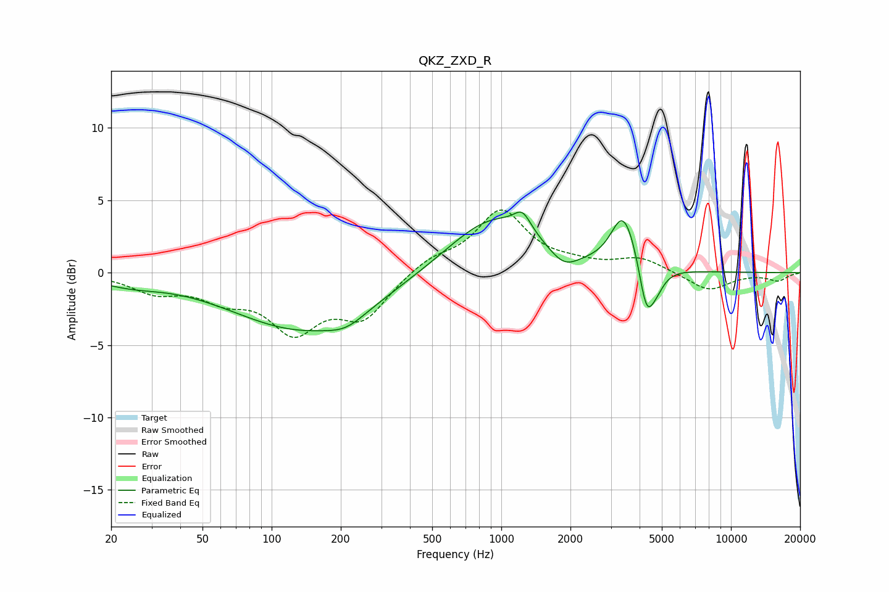

# QKZ_ZXD_R
See [usage instructions](https://github.com/jaakkopasanen/AutoEq#usage) for more options and info.

### Parametric EQs
Apply preamp of -4.3 dB when using parametric equalizer.

|   # | Type    |   Fc (Hz) |    Q |   Gain (dB) |
|-----|---------|-----------|------|-------------|
|   1 | Peaking |        24 | 1.03 |        -0.6 |
|   2 | Peaking |       139 | 0.45 |        -3.9 |
|   3 | Peaking |       211 | 1.76 |        -0.7 |
|   4 | Peaking |       929 | 0.72 |         4   |
|   5 | Peaking |      1236 | 3.9  |         1.2 |
|   6 | Peaking |      1871 | 2.17 |        -1.2 |
|   7 | Peaking |      3350 | 2.79 |         2.9 |
|   8 | Peaking |      3687 | 2.64 |         1.2 |
|   9 | Peaking |      4284 | 4.23 |        -3.5 |
|  10 | Peaking |      4742 | 3.81 |        -1   |

### Fixed Band EQs
When using fixed band (also called graphic) equalizer, apply preamp of **-4.4 dB** (if available) and set gains manually with these parameters.

|   # | Type    |   Fc (Hz) |    Q |   Gain (dB) |
|-----|---------|-----------|------|-------------|
|   1 | Peaking |        31 | 1.41 |        -1.2 |
|   2 | Peaking |        62 | 1.41 |        -1.5 |
|   3 | Peaking |       125 | 1.41 |        -3.7 |
|   4 | Peaking |       250 | 1.41 |        -2.9 |
|   5 | Peaking |       500 | 1.41 |         0.9 |
|   6 | Peaking |      1000 | 1.41 |         4.2 |
|   7 | Peaking |      2000 | 1.41 |         0.4 |
|   8 | Peaking |      4000 | 1.41 |         1   |
|   9 | Peaking |      8000 | 1.41 |        -1.3 |
|  10 | Peaking |     16000 | 1.41 |        -0.5 |

### Graphs

