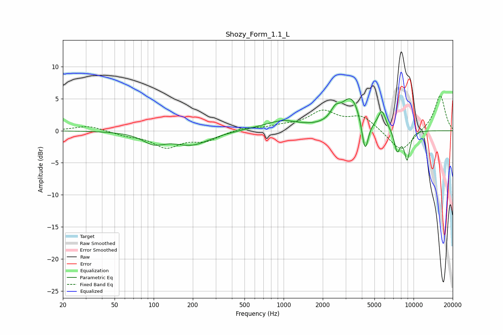

# Shozy_Form_1.1_L
See [usage instructions](https://github.com/jaakkopasanen/AutoEq#usage) for more options and info.

### Parametric EQs
Apply preamp of -5.1 dB when using parametric equalizer.

|   # | Type    |   Fc (Hz) |    Q |   Gain (dB) |
|-----|---------|-----------|------|-------------|
|   1 | Peaking |       100 | 1.67 |        -1.6 |
|   2 | Peaking |       196 | 1.01 |        -2.1 |
|   3 | Peaking |       937 | 0.86 |         1.2 |
|   4 | Peaking |      1014 | 1.91 |         0.3 |
|   5 | Peaking |      2501 | 3.9  |         1.6 |
|   6 | Peaking |      3319 | 1.83 |         5.1 |
|   7 | Peaking |      4231 | 5.54 |        -5.5 |
|   8 | Peaking |      5705 | 4.67 |         2.8 |
|   9 | Peaking |      7487 | 5.76 |        -3.3 |
|  10 | Peaking |      8915 | 5.94 |        -4.4 |

### Fixed Band EQs
When using fixed band (also called graphic) equalizer, apply preamp of **-5.5 dB** (if available) and set gains manually with these parameters.

|   # | Type    |   Fc (Hz) |    Q |   Gain (dB) |
|-----|---------|-----------|------|-------------|
|   1 | Peaking |        31 | 1.41 |         0.8 |
|   2 | Peaking |        62 | 1.41 |        -0.6 |
|   3 | Peaking |       125 | 1.41 |        -2.4 |
|   4 | Peaking |       250 | 1.41 |        -1.4 |
|   5 | Peaking |       500 | 1.41 |         0.5 |
|   6 | Peaking |      1000 | 1.41 |         0.6 |
|   7 | Peaking |      2000 | 1.41 |         2.8 |
|   8 | Peaking |      4000 | 1.41 |         2.1 |
|   9 | Peaking |      8000 | 1.41 |        -3.4 |
|  10 | Peaking |     16000 | 1.41 |         5.6 |

### Graphs

