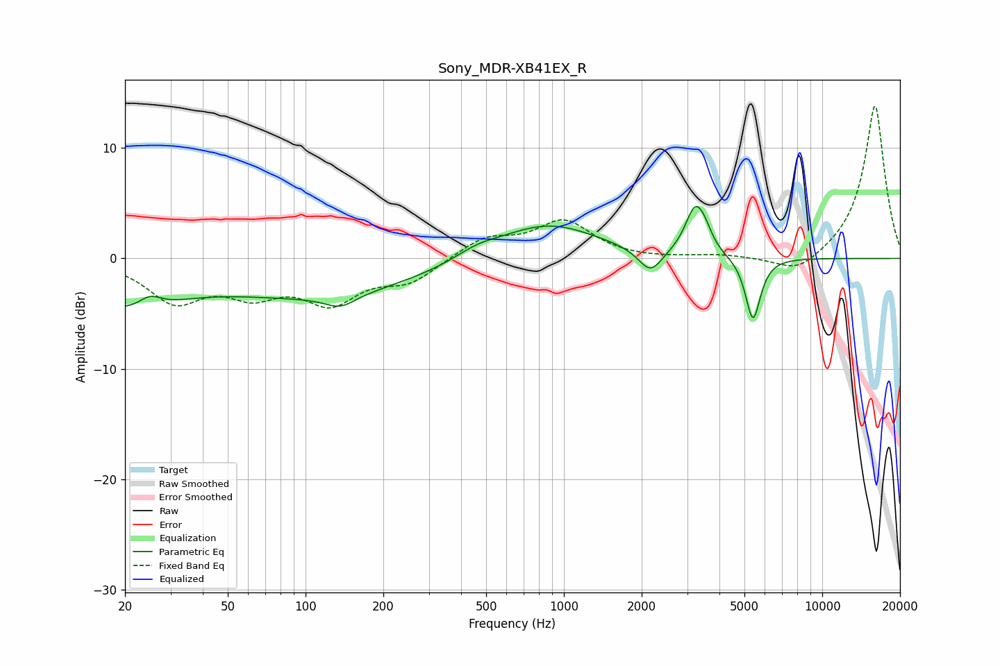

# Sony_MDR-XB41EX_R
See [usage instructions](https://github.com/jaakkopasanen/AutoEq#usage) for more options and info.

### Parametric EQs
Apply preamp of -4.8 dB when using parametric equalizer.

|   # | Type    |   Fc (Hz) |    Q |   Gain (dB) |
|-----|---------|-----------|------|-------------|
|   1 | Peaking |        20 | 0.73 |        -4   |
|   2 | Peaking |        25 | 3.15 |         1.1 |
|   3 | Peaking |       114 | 0.35 |        -3.3 |
|   4 | Peaking |       136 | 2.39 |        -1.1 |
|   5 | Peaking |       462 | 1.68 |         0.7 |
|   6 | Peaking |       855 | 0.71 |         3.3 |
|   7 | Peaking |      2161 | 3.11 |        -2.2 |
|   8 | Peaking |      3225 | 3.63 |         4.3 |
|   9 | Peaking |      3521 | 5.17 |         0.9 |
|  10 | Peaking |      5394 | 4.82 |        -5.8 |

### Fixed Band EQs
When using fixed band (also called graphic) equalizer, apply preamp of **-13.9 dB** (if available) and set gains manually with these parameters.

|   # | Type    |   Fc (Hz) |    Q |   Gain (dB) |
|-----|---------|-----------|------|-------------|
|   1 | Peaking |        31 | 1.41 |        -3.6 |
|   2 | Peaking |        62 | 1.41 |        -2.7 |
|   3 | Peaking |       125 | 1.41 |        -3.6 |
|   4 | Peaking |       250 | 1.41 |        -2   |
|   5 | Peaking |       500 | 1.41 |         1.8 |
|   6 | Peaking |      1000 | 1.41 |         3.3 |
|   7 | Peaking |      2000 | 1.41 |        -0.1 |
|   8 | Peaking |      4000 | 1.41 |         0.3 |
|   9 | Peaking |      8000 | 1.41 |        -1.6 |
|  10 | Peaking |     16000 | 1.41 |        14   |

### Graphs

