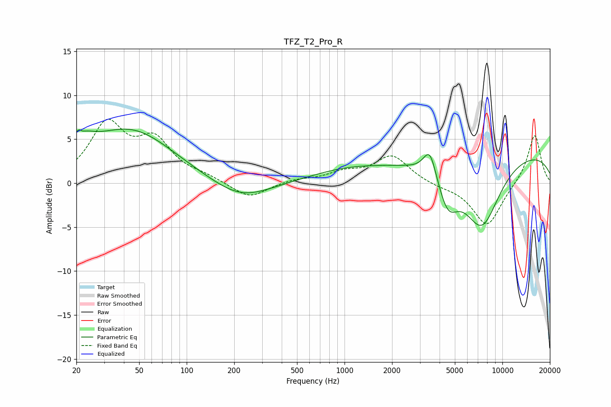

# TFZ_T2_Pro_R
See [usage instructions](https://github.com/jaakkopasanen/AutoEq#usage) for more options and info.

### Parametric EQs
Apply preamp of -6.3 dB when using parametric equalizer.

|   # | Type    |   Fc (Hz) |    Q |   Gain (dB) |
|-----|---------|-----------|------|-------------|
|   1 | Peaking |        21 | 5.7  |         3.1 |
|   2 | Peaking |        21 | 5.99 |        -2.6 |
|   3 | Peaking |        22 | 1.74 |         1.9 |
|   4 | Peaking |        44 | 0.51 |         6   |
|   5 | Peaking |       220 | 0.76 |        -2.1 |
|   6 | Peaking |      1025 | 0.56 |         1.3 |
|   7 | Peaking |      3473 | 3.5  |         3.2 |
|   8 | Peaking |      4510 | 2.13 |        -4.1 |
|   9 | Peaking |      7392 | 1.12 |        -8.1 |
|  10 | Peaking |      9655 | 0.19 |         3.8 |

### Fixed Band EQs
When using fixed band (also called graphic) equalizer, apply preamp of **-7.4 dB** (if available) and set gains manually with these parameters.

|   # | Type    |   Fc (Hz) |    Q |   Gain (dB) |
|-----|---------|-----------|------|-------------|
|   1 | Peaking |        31 | 1.41 |         6.4 |
|   2 | Peaking |        62 | 1.41 |         4.4 |
|   3 | Peaking |       125 | 1.41 |         0.6 |
|   4 | Peaking |       250 | 1.41 |        -1.8 |
|   5 | Peaking |       500 | 1.41 |         0.4 |
|   6 | Peaking |      1000 | 1.41 |         1.1 |
|   7 | Peaking |      2000 | 1.41 |         3.1 |
|   8 | Peaking |      4000 | 1.41 |        -0.3 |
|   9 | Peaking |      8000 | 1.41 |        -4.9 |
|  10 | Peaking |     16000 | 1.41 |         5.7 |

### Graphs

