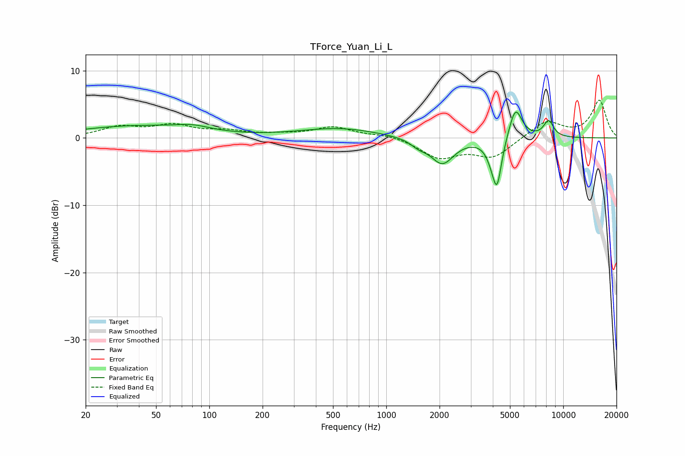

# TForce_Yuan_Li_L
See [usage instructions](https://github.com/jaakkopasanen/AutoEq#usage) for more options and info.

### Parametric EQs
Apply preamp of -4.0 dB when using parametric equalizer.

|   # | Type    |   Fc (Hz) |    Q |   Gain (dB) |
|-----|---------|-----------|------|-------------|
|   1 | Peaking |        38 | 0.42 |         1.7 |
|   2 | Peaking |        81 | 1.47 |         0.7 |
|   3 | Peaking |       540 | 0.63 |         1.4 |
|   4 | Peaking |      1524 | 3.15 |        -0.8 |
|   5 | Peaking |      2072 | 2.16 |        -3.8 |
|   6 | Peaking |      3954 | 4.01 |        -1.4 |
|   7 | Peaking |      4223 | 5.27 |        -6.6 |
|   8 | Peaking |      5369 | 3.73 |         4.8 |
|   9 | Peaking |      8149 | 5.99 |        -0.5 |
|  10 | Peaking |      8237 | 4.75 |         2.9 |

### Fixed Band EQs
When using fixed band (also called graphic) equalizer, apply preamp of **-5.7 dB** (if available) and set gains manually with these parameters.

|   # | Type    |   Fc (Hz) |    Q |   Gain (dB) |
|-----|---------|-----------|------|-------------|
|   1 | Peaking |        31 | 1.41 |         1.5 |
|   2 | Peaking |        62 | 1.41 |         1.7 |
|   3 | Peaking |       125 | 1.41 |         0.9 |
|   4 | Peaking |       250 | 1.41 |         0.4 |
|   5 | Peaking |       500 | 1.41 |         1.6 |
|   6 | Peaking |      1000 | 1.41 |         0.5 |
|   7 | Peaking |      2000 | 1.41 |        -2.8 |
|   8 | Peaking |      4000 | 1.41 |        -2.8 |
|   9 | Peaking |      8000 | 1.41 |         2.6 |
|  10 | Peaking |     16000 | 1.41 |         5.5 |

### Graphs

