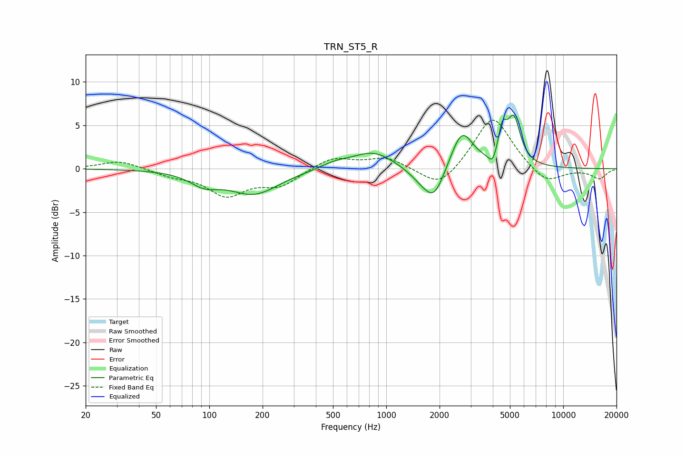

# TRN_ST5_R
See [usage instructions](https://github.com/jaakkopasanen/AutoEq#usage) for more options and info.

### Parametric EQs
Apply preamp of -6.3 dB when using parametric equalizer.

|   # | Type    |   Fc (Hz) |    Q |   Gain (dB) |
|-----|---------|-----------|------|-------------|
|   1 | Peaking |        93 | 1.78 |        -1.3 |
|   2 | Peaking |       179 | 0.98 |        -2.8 |
|   3 | Peaking |       514 | 1.65 |         0.7 |
|   4 | Peaking |       846 | 1.24 |         2   |
|   5 | Peaking |      1578 | 1.92 |        -1.1 |
|   6 | Peaking |      1866 | 2.39 |        -3.5 |
|   7 | Peaking |      2675 | 2.26 |         4.5 |
|   8 | Peaking |      3990 | 6    |        -1.4 |
|   9 | Peaking |      4530 | 5.93 |         3.2 |
|  10 | Peaking |      5256 | 3.68 |         5.3 |

### Fixed Band EQs
When using fixed band (also called graphic) equalizer, apply preamp of **-5.7 dB** (if available) and set gains manually with these parameters.

|   # | Type    |   Fc (Hz) |    Q |   Gain (dB) |
|-----|---------|-----------|------|-------------|
|   1 | Peaking |        31 | 1.41 |         1   |
|   2 | Peaking |        62 | 1.41 |        -0.7 |
|   3 | Peaking |       125 | 1.41 |        -2.9 |
|   4 | Peaking |       250 | 1.41 |        -1.8 |
|   5 | Peaking |       500 | 1.41 |         1.4 |
|   6 | Peaking |      1000 | 1.41 |         1.2 |
|   7 | Peaking |      2000 | 1.41 |        -2.5 |
|   8 | Peaking |      4000 | 1.41 |         6.3 |
|   9 | Peaking |      8000 | 1.41 |        -1.9 |
|  10 | Peaking |     16000 | 1.41 |        -1.1 |

### Graphs

