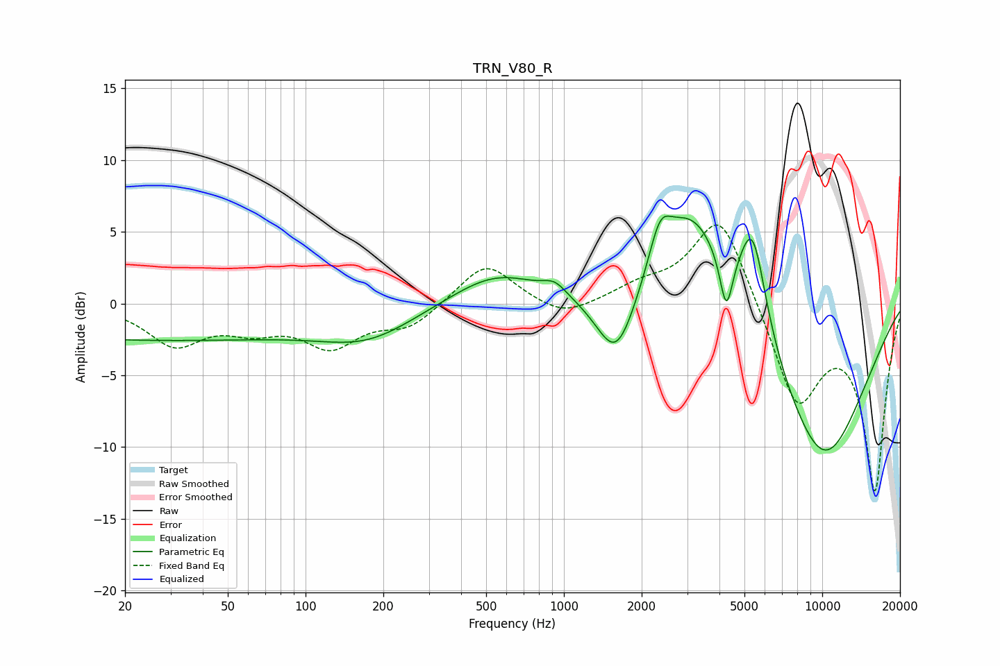

# TRN_V80_R
See [usage instructions](https://github.com/jaakkopasanen/AutoEq#usage) for more options and info.

### Parametric EQs
Apply preamp of -6.2 dB when using parametric equalizer.

|   # | Type    |   Fc (Hz) |    Q |   Gain (dB) |
|-----|---------|-----------|------|-------------|
|   1 | Peaking |        24 | 0.18 |        -2.5 |
|   2 | Peaking |       175 | 0.77 |        -1.9 |
|   3 | Peaking |       547 | 0.82 |         2.2 |
|   4 | Peaking |       922 | 3.11 |         0.8 |
|   5 | Peaking |      1598 | 1.79 |        -5.3 |
|   6 | Peaking |      2355 | 3.35 |         2.8 |
|   7 | Peaking |      3119 | 0.99 |         7.5 |
|   8 | Peaking |      4252 | 5.76 |        -3.9 |
|   9 | Peaking |      5377 | 2.55 |         7.1 |
|  10 | Peaking |     10000 | 0.62 |       -11.1 |

### Fixed Band EQs
When using fixed band (also called graphic) equalizer, apply preamp of **-5.6 dB** (if available) and set gains manually with these parameters.

|   # | Type    |   Fc (Hz) |    Q |   Gain (dB) |
|-----|---------|-----------|------|-------------|
|   1 | Peaking |        31 | 1.41 |        -2.7 |
|   2 | Peaking |        62 | 1.41 |        -1.4 |
|   3 | Peaking |       125 | 1.41 |        -2.7 |
|   4 | Peaking |       250 | 1.41 |        -1.6 |
|   5 | Peaking |       500 | 1.41 |         2.9 |
|   6 | Peaking |      1000 | 1.41 |        -1.1 |
|   7 | Peaking |      2000 | 1.41 |         1   |
|   8 | Peaking |      4000 | 1.41 |         6.5 |
|   9 | Peaking |      8000 | 1.41 |        -7   |
|  10 | Peaking |     16000 | 1.41 |       -12.8 |

### Graphs

