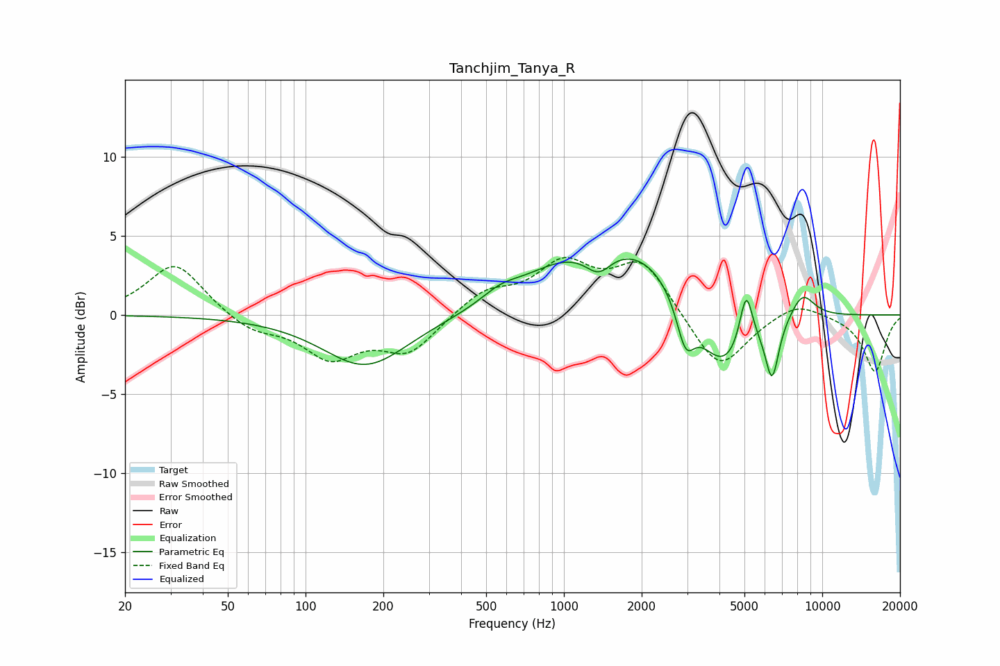

# Tanchjim_Tanya_R
See [usage instructions](https://github.com/jaakkopasanen/AutoEq#usage) for more options and info.

### Parametric EQs
Apply preamp of -3.6 dB when using parametric equalizer.

|   # | Type    |   Fc (Hz) |    Q |   Gain (dB) |
|-----|---------|-----------|------|-------------|
|   1 | Peaking |       170 | 0.86 |        -3.3 |
|   2 | Peaking |       568 | 1.81 |         0.8 |
|   3 | Peaking |       953 | 0.9  |         1.8 |
|   4 | Peaking |      1363 | 2.81 |        -1.3 |
|   5 | Peaking |      1934 | 0.68 |         4   |
|   6 | Peaking |      2956 | 4.02 |        -2.8 |
|   7 | Peaking |      4117 | 1.3  |        -4.5 |
|   8 | Peaking |      5075 | 5.48 |         3.5 |
|   9 | Peaking |      6397 | 5.24 |        -3.6 |
|  10 | Peaking |      8379 | 2.74 |         1.6 |

### Fixed Band EQs
When using fixed band (also called graphic) equalizer, apply preamp of **-3.7 dB** (if available) and set gains manually with these parameters.

|   # | Type    |   Fc (Hz) |    Q |   Gain (dB) |
|-----|---------|-----------|------|-------------|
|   1 | Peaking |        31 | 1.41 |         3.3 |
|   2 | Peaking |        62 | 1.41 |        -1   |
|   3 | Peaking |       125 | 1.41 |        -2.5 |
|   4 | Peaking |       250 | 1.41 |        -2.3 |
|   5 | Peaking |       500 | 1.41 |         1.4 |
|   6 | Peaking |      1000 | 1.41 |         3   |
|   7 | Peaking |      2000 | 1.41 |         3.3 |
|   8 | Peaking |      4000 | 1.41 |        -3.7 |
|   9 | Peaking |      8000 | 1.41 |         1   |
|  10 | Peaking |     16000 | 1.41 |        -3.6 |

### Graphs

