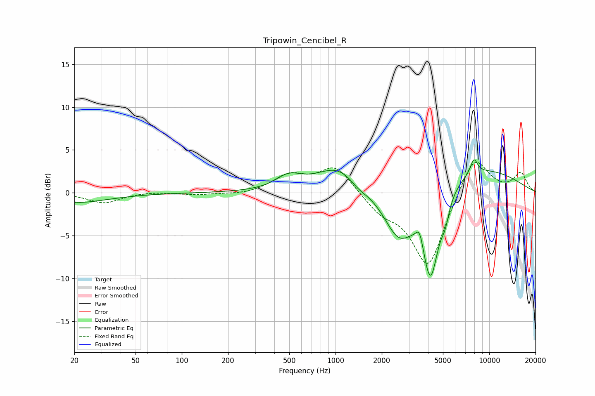

# Tripowin_Cencibel_R
See [usage instructions](https://github.com/jaakkopasanen/AutoEq#usage) for more options and info.

### Parametric EQs
Apply preamp of -3.9 dB when using parametric equalizer.

|   # | Type    |   Fc (Hz) |    Q |   Gain (dB) |
|-----|---------|-----------|------|-------------|
|   1 | Peaking |        20 | 0.65 |        -1.2 |
|   2 | Peaking |       496 | 1.64 |         1.5 |
|   3 | Peaking |      1049 | 0.99 |         3   |
|   4 | Peaking |      1409 | 2.45 |        -0.7 |
|   5 | Peaking |      2576 | 1.39 |        -5.6 |
|   6 | Peaking |      3523 | 5.89 |         1.9 |
|   7 | Peaking |      4153 | 2.49 |       -10.5 |
|   8 | Peaking |      5171 | 5.19 |        -1.9 |
|   9 | Peaking |      7598 | 0.39 |         3.1 |
|  10 | Peaking |      7954 | 5.65 |         1.8 |

### Fixed Band EQs
When using fixed band (also called graphic) equalizer, apply preamp of **-3.6 dB** (if available) and set gains manually with these parameters.

|   # | Type    |   Fc (Hz) |    Q |   Gain (dB) |
|-----|---------|-----------|------|-------------|
|   1 | Peaking |        31 | 1.41 |        -1.2 |
|   2 | Peaking |        62 | 1.41 |         0.2 |
|   3 | Peaking |       125 | 1.41 |        -0.2 |
|   4 | Peaking |       250 | 1.41 |        -0.3 |
|   5 | Peaking |       500 | 1.41 |         1.9 |
|   6 | Peaking |      1000 | 1.41 |         3.1 |
|   7 | Peaking |      2000 | 1.41 |        -1.9 |
|   8 | Peaking |      4000 | 1.41 |        -8.7 |
|   9 | Peaking |      8000 | 1.41 |         4.8 |
|  10 | Peaking |     16000 | 1.41 |         2.2 |

### Graphs

