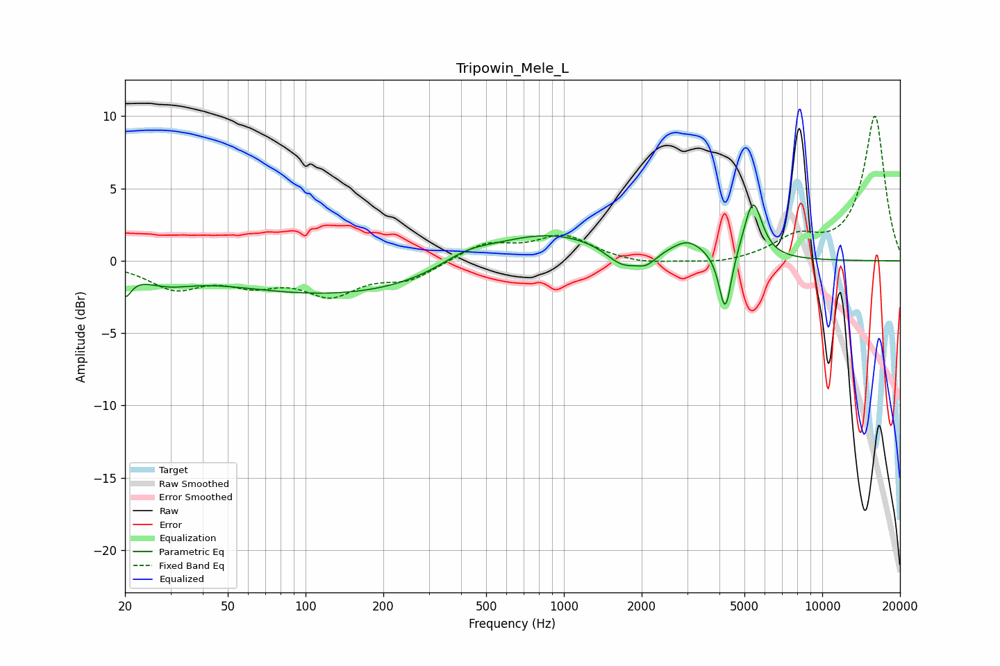

# Tripowin_Mele_L
See [usage instructions](https://github.com/jaakkopasanen/AutoEq#usage) for more options and info.

### Parametric EQs
Apply preamp of -4.0 dB when using parametric equalizer.

|   # | Type    |   Fc (Hz) |    Q |   Gain (dB) |
|-----|---------|-----------|------|-------------|
|   1 | Peaking |        20 | 5.82 |        -1.6 |
|   2 | Peaking |        29 | 1.35 |        -0.9 |
|   3 | Peaking |       144 | 0.3  |        -2.4 |
|   4 | Peaking |       416 | 1.37 |         0.9 |
|   5 | Peaking |       825 | 0.56 |         2.3 |
|   6 | Peaking |      1682 | 2.17 |        -1.3 |
|   7 | Peaking |      2086 | 3.69 |        -0.7 |
|   8 | Peaking |      3018 | 2.19 |         1.1 |
|   9 | Peaking |      4212 | 5.93 |        -4.3 |
|  10 | Peaking |      5397 | 3.92 |         4   |

### Fixed Band EQs
When using fixed band (also called graphic) equalizer, apply preamp of **-10.1 dB** (if available) and set gains manually with these parameters.

|   # | Type    |   Fc (Hz) |    Q |   Gain (dB) |
|-----|---------|-----------|------|-------------|
|   1 | Peaking |        31 | 1.41 |        -1.8 |
|   2 | Peaking |        62 | 1.41 |        -1.3 |
|   3 | Peaking |       125 | 1.41 |        -2.1 |
|   4 | Peaking |       250 | 1.41 |        -1.2 |
|   5 | Peaking |       500 | 1.41 |         1.2 |
|   6 | Peaking |      1000 | 1.41 |         1.7 |
|   7 | Peaking |      2000 | 1.41 |        -0.3 |
|   8 | Peaking |      4000 | 1.41 |        -0.3 |
|   9 | Peaking |      8000 | 1.41 |         1.5 |
|  10 | Peaking |     16000 | 1.41 |        10   |

### Graphs

