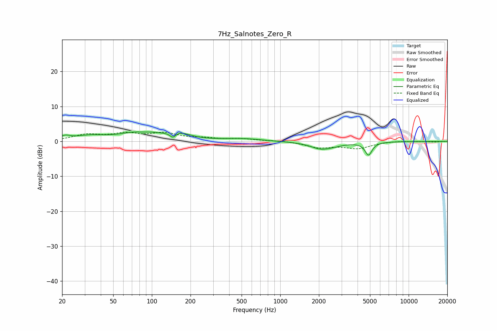

# 7Hz_Salnotes_Zero_R
See [usage instructions](https://github.com/jaakkopasanen/AutoEq#usage) for more options and info.

### Parametric EQs
Apply preamp of -2.8 dB when using parametric equalizer.

|   # | Type    |   Fc (Hz) |    Q |   Gain (dB) |
|-----|---------|-----------|------|-------------|
|   1 | Peaking |        21 | 3.55 |         1   |
|   2 | Peaking |        33 | 1.23 |         1.3 |
|   3 | Peaking |        82 | 1.02 |         2.8 |
|   4 | Peaking |        84 | 2.4  |        -0.6 |
|   5 | Peaking |       146 | 6    |        -1.6 |
|   6 | Peaking |       162 | 1.64 |         1.8 |
|   7 | Peaking |       501 | 0.94 |         0.7 |
|   8 | Peaking |      1979 | 2.83 |        -0.4 |
|   9 | Peaking |      2231 | 1.35 |        -1.9 |
|  10 | Peaking |      4870 | 5.16 |        -3.6 |

### Fixed Band EQs
When using fixed band (also called graphic) equalizer, apply preamp of **-2.7 dB** (if available) and set gains manually with these parameters.

|   # | Type    |   Fc (Hz) |    Q |   Gain (dB) |
|-----|---------|-----------|------|-------------|
|   1 | Peaking |        31 | 1.41 |         1.7 |
|   2 | Peaking |        62 | 1.41 |         1.9 |
|   3 | Peaking |       125 | 1.41 |         2.1 |
|   4 | Peaking |       250 | 1.41 |         0.7 |
|   5 | Peaking |       500 | 1.41 |         0.6 |
|   6 | Peaking |      1000 | 1.41 |         0.2 |
|   7 | Peaking |      2000 | 1.41 |        -1.6 |
|   8 | Peaking |      4000 | 1.41 |        -1.9 |
|   9 | Peaking |      8000 | 1.41 |         0.2 |
|  10 | Peaking |     16000 | 1.41 |        -0.2 |

### Graphs

