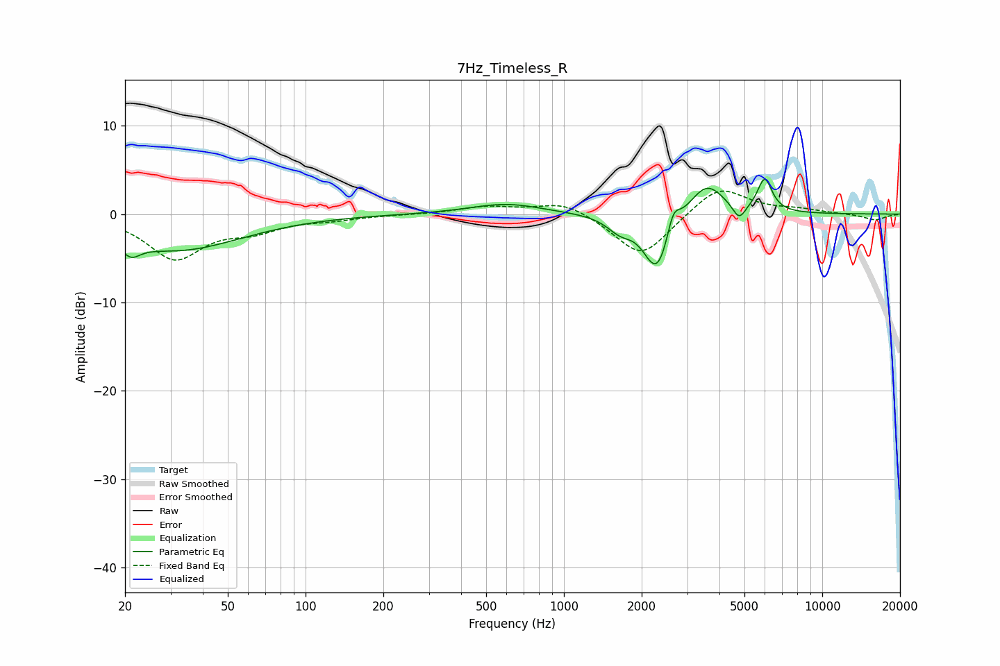

# 7Hz_Timeless_R
See [usage instructions](https://github.com/jaakkopasanen/AutoEq#usage) for more options and info.

### Parametric EQs
Apply preamp of -4.1 dB when using parametric equalizer.

|   # | Type    |   Fc (Hz) |    Q |   Gain (dB) |
|-----|---------|-----------|------|-------------|
|   1 | Peaking |        21 | 3.84 |        -1.6 |
|   2 | Peaking |        32 | 0.57 |        -4   |
|   3 | Peaking |       597 | 1.03 |         1.2 |
|   4 | Peaking |      1653 | 2.75 |        -1.7 |
|   5 | Peaking |      2145 | 3.38 |        -1.2 |
|   6 | Peaking |      2328 | 2.95 |        -5.6 |
|   7 | Peaking |      2649 | 6    |         2.5 |
|   8 | Peaking |      3567 | 2.1  |         3.6 |
|   9 | Peaking |      4766 | 5.57 |        -1.8 |
|  10 | Peaking |      5991 | 4.96 |         3.8 |

### Fixed Band EQs
When using fixed band (also called graphic) equalizer, apply preamp of **-2.7 dB** (if available) and set gains manually with these parameters.

|   # | Type    |   Fc (Hz) |    Q |   Gain (dB) |
|-----|---------|-----------|------|-------------|
|   1 | Peaking |        31 | 1.41 |        -4.9 |
|   2 | Peaking |        62 | 1.41 |        -1.5 |
|   3 | Peaking |       125 | 1.41 |        -0.5 |
|   4 | Peaking |       250 | 1.41 |        -0   |
|   5 | Peaking |       500 | 1.41 |         0.8 |
|   6 | Peaking |      1000 | 1.41 |         1.5 |
|   7 | Peaking |      2000 | 1.41 |        -5   |
|   8 | Peaking |      4000 | 1.41 |         3.3 |
|   9 | Peaking |      8000 | 1.41 |         0.4 |
|  10 | Peaking |     16000 | 1.41 |        -0.7 |

### Graphs

